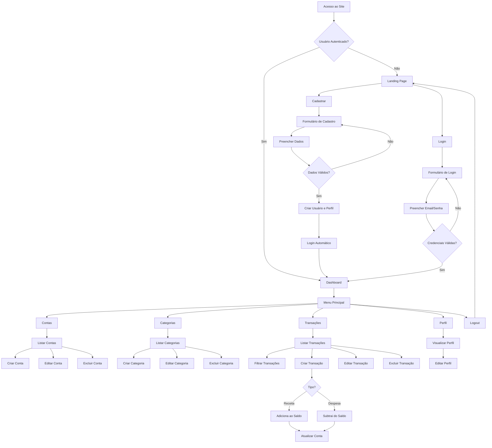
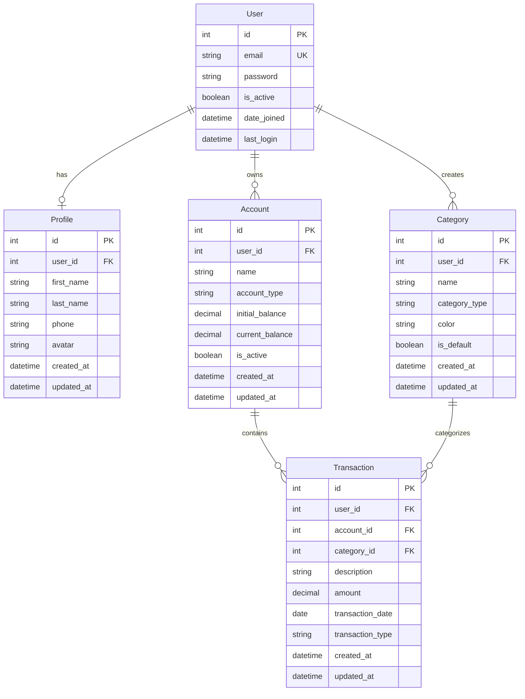

# PRD - Finanpy
## Product Requirement Document

---

## 1. Visão Geral

O **Finanpy** é um sistema de gestão de finanças pessoais desenvolvido com Django, que permite aos usuários controlar suas receitas, despesas, contas bancárias e categorizar suas transações de forma simples e intuitiva. O projeto prioriza simplicidade, praticidade e uma experiência de usuário moderna e responsiva.

---

## 2. Sobre o Produto

O Finanpy é uma aplicação web full-stack construída com Django que oferece uma solução completa para gerenciamento financeiro pessoal. Utilizando o Django Template Language com TailwindCSS, o sistema apresenta uma interface moderna com design em modo escuro e gradientes harmônicos. A arquitetura é modular, separando as responsabilidades em apps Django distintos (users, profiles, accounts, categories, transactions), garantindo manutenibilidade e escalabilidade.

---

## 3. Propósito

Fornecer uma ferramenta simples, eficiente e acessível para que pessoas possam:
- Controlar suas finanças pessoais de forma organizada
- Visualizar entradas e saídas de forma clara
- Categorizar transações para melhor análise de gastos
- Gerenciar múltiplas contas bancárias
- Tomar decisões financeiras mais conscientes através de dados consolidados

---

## 4. Público Alvo

- **Primário**: Pessoas físicas que buscam organizar suas finanças pessoais
- **Secundário**: Profissionais liberais e freelancers que precisam controlar receitas e despesas
- **Características**:
  - Idade: 18-55 anos
  - Acesso à internet e dispositivos desktop/mobile
  - Nível de alfabetização digital: básico a avançado
  - Necessidade de controle financeiro pessoal

---

## 5. Objetivos

### 5.1 Objetivos de Negócio
- Criar uma solução simples e funcional para gestão financeira pessoal
- Desenvolver um MVP enxuto sem over-engineering
- Estabelecer base sólida para futuras expansões

### 5.2 Objetivos de Produto
- Permitir cadastro e autenticação segura de usuários via email
- Possibilitar gerenciamento completo de contas bancárias
- Facilitar registro e categorização de transações financeiras
- Apresentar dashboard com visão consolidada das finanças
- Garantir interface responsiva e agradável em todos os dispositivos

### 5.3 Objetivos Técnicos
- Desenvolver aplicação Django seguindo boas práticas (PEP8)
- Implementar arquitetura modular com separação de responsabilidades
- Utilizar recursos nativos do Django (Class-Based Views, sistema de autenticação)
- Criar design system consistente com TailwindCSS

---

## 6. Requisitos Funcionais

### 6.1 Autenticação e Usuários
- **RF001**: Sistema deve permitir cadastro de novos usuários
- **RF002**: Sistema deve permitir login via email e senha
- **RF003**: Sistema deve permitir logout
- **RF004**: Sistema deve permitir recuperação de senha
- **RF005**: Usuário deve ter perfil associado automaticamente

### 6.2 Perfil de Usuário
- **RF006**: Usuário deve visualizar seu perfil
- **RF007**: Usuário deve editar informações do perfil
- **RF008**: Sistema deve armazenar created_at e updated_at do perfil

### 6.3 Contas Bancárias
- **RF009**: Usuário deve criar contas bancárias
- **RF010**: Usuário deve editar contas bancárias
- **RF011**: Usuário deve excluir contas bancárias
- **RF012**: Usuário deve listar suas contas bancárias
- **RF013**: Conta deve ter: nome, tipo, saldo inicial, saldo atual
- **RF014**: Usuário só pode ver suas próprias contas

### 6.4 Categorias
- **RF015**: Usuário deve criar categorias personalizadas
- **RF016**: Usuário deve editar categorias
- **RF017**: Usuário deve excluir categorias (se não houver transações vinculadas)
- **RF018**: Usuário deve listar suas categorias
- **RF019**: Categoria deve ter: nome, tipo (receita/despesa), cor
- **RF020**: Sistema deve fornecer categorias padrão iniciais

### 6.5 Transações
- **RF021**: Usuário deve registrar transações (receitas/despesas)
- **RF022**: Usuário deve editar transações
- **RF023**: Usuário deve excluir transações
- **RF024**: Usuário deve listar transações com filtros
- **RF025**: Transação deve ter: descrição, valor, data, tipo, categoria, conta
- **RF026**: Sistema deve atualizar saldo da conta ao criar/editar/excluir transação
- **RF027**: Usuário deve filtrar transações por período, categoria, tipo, conta

### 6.6 Dashboard
- **RF028**: Dashboard deve exibir saldo total de todas as contas
- **RF029**: Dashboard deve exibir total de receitas do período
- **RF030**: Dashboard deve exibir total de despesas do período
- **RF031**: Dashboard deve exibir saldo do período (receitas - despesas)
- **RF032**: Dashboard deve listar últimas transações
- **RF033**: Dashboard deve exibir resumo por categoria
- **RF034**: Dashboard deve permitir seleção de período de análise

### 6.7 Site Público
- **RF035**: Site deve ter página inicial pública
- **RF036**: Página inicial deve apresentar o produto
- **RF037**: Página inicial deve ter botões de cadastro e login
- **RF038**: Após login, redirecionar para dashboard

### 6.8 Flowchart - Fluxos de UX



---

## 7. Requisitos Não-Funcionais

### 7.1 Usabilidade
- **RNF001**: Interface deve ser intuitiva e de fácil navegação
- **RNF002**: Sistema deve ser responsivo (desktop, tablet, mobile)
- **RNF003**: Feedback visual para todas as ações do usuário
- **RNF004**: Mensagens de erro claras e em português

### 7.2 Performance
- **RNF005**: Páginas devem carregar em menos de 2 segundos
- **RNF006**: Sistema deve suportar até 1000 transações por usuário sem degradação
- **RNF007**: Queries ao banco devem ser otimizadas

### 7.3 Segurança
- **RNF008**: Senhas devem ser armazenadas com hash
- **RNF009**: Sessões devem expirar após período de inatividade
- **RNF010**: Validação de dados no backend
- **RNF011**: Proteção contra CSRF
- **RNF012**: Usuários só podem acessar seus próprios dados

### 7.4 Manutenibilidade
- **RNF013**: Código deve seguir PEP8
- **RNF014**: Código deve usar aspas simples
- **RNF015**: Código deve estar em inglês
- **RNF016**: Arquitetura modular com apps separados
- **RNF017**: Documentação clara em docstrings

### 7.5 Compatibilidade
- **RNF018**: Suporte aos navegadores modernos (Chrome, Firefox, Safari, Edge)
- **RNF019**: Python 3.10+
- **RNF020**: Django 4.2+

---

## 8. Arquitetura Técnica

### 8.1 Stack Tecnológica

**Backend:**
- Python 3.13+
- Django 5+
- SQLite (banco de dados)

**Frontend:**
- Django Template Language
- django-tailwind (TailwindCSS integration)
- TailwindCSS 3.x
- JavaScript vanilla (mínimo necessário)

**Infraestrutura (Sprints Finais):**
- Docker (futuro)
- Testes automatizados (futuro)
- Gerenciador de pacote pip

### 8.2 Estrutura de Dados



### 8.3 Modelo de Dados Detalhado

**User (Django default)**
- Utiliza modelo AbstractUser customizado
- Email como USERNAME_FIELD

**Profile**
- `user`: OneToOneField(User)
- `first_name`: CharField(max_length=100)
- `last_name`: CharField(max_length=100)
- `phone`: CharField(max_length=20, blank=True)
- `avatar`: ImageField(blank=True, null=True)
- `created_at`: DateTimeField(auto_now_add=True)
- `updated_at`: DateTimeField(auto_now=True)

**Account**
- `user`: ForeignKey(User)
- `name`: CharField(max_length=100)
- `account_type`: CharField(choices=['checking', 'savings', 'investment', 'other'])
- `initial_balance`: DecimalField(max_digits=12, decimal_places=2)
- `current_balance`: DecimalField(max_digits=12, decimal_places=2)
- `is_active`: BooleanField(default=True)
- `created_at`: DateTimeField(auto_now_add=True)
- `updated_at`: DateTimeField(auto_now=True)

**Category**
- `user`: ForeignKey(User)
- `name`: CharField(max_length=100)
- `category_type`: CharField(choices=['income', 'expense'])
- `color`: CharField(max_length=7)
- `is_default`: BooleanField(default=False)
- `created_at`: DateTimeField(auto_now_add=True)
- `updated_at`: DateTimeField(auto_now=True)

**Transaction**
- `user`: ForeignKey(User)
- `account`: ForeignKey(Account)
- `category`: ForeignKey(Category)
- `description`: CharField(max_length=255)
- `amount`: DecimalField(max_digits=12, decimal_places=2)
- `transaction_date`: DateField()
- `transaction_type`: CharField(choices=['income', 'expense'])
- `created_at`: DateTimeField(auto_now_add=True)
- `updated_at`: DateTimeField(auto_now=True)

---

## 9. Design System

### 9.1 Paleta de Cores (TailwindCSS)

**Cores Primárias:**
- Primary: `bg-gradient-to-r from-purple-600 to-blue-600`
- Secondary: `bg-gradient-to-r from-cyan-500 to-blue-500`
- Accent: `bg-gradient-to-r from-pink-500 to-purple-600`

**Cores de Fundo:**
- Background Principal: `bg-gray-900`
- Background Secundário: `bg-gray-800`
- Background Card: `bg-gray-800/50 backdrop-blur-sm`
- Border: `border-gray-700`

**Cores de Texto:**
- Texto Principal: `text-gray-100`
- Texto Secundário: `text-gray-400`
- Texto Destaque: `text-white`

**Cores de Status:**
- Sucesso: `text-green-400`, `bg-green-500`
- Erro: `text-red-400`, `bg-red-500`
- Aviso: `text-yellow-400`, `bg-yellow-500`
- Info: `text-blue-400`, `bg-blue-500`

**Cores Funcionais:**
- Receita: `text-green-400`, `bg-green-500/10`
- Despesa: `text-red-400`, `bg-red-500/10`

### 9.2 Tipografia

**Família de Fontes:**
```css
font-family: 'Inter', system-ui, -apple-system, sans-serif;
```

**Tamanhos:**
- Heading 1: `text-4xl font-bold` (36px)
- Heading 2: `text-3xl font-bold` (30px)
- Heading 3: `text-2xl font-semibold` (24px)
- Heading 4: `text-xl font-semibold` (20px)
- Body Large: `text-lg` (18px)
- Body: `text-base` (16px)
- Body Small: `text-sm` (14px)
- Caption: `text-xs` (12px)

### 9.3 Componentes

**Botões:**

*Primário:*
```html
<button class="px-6 py-3 bg-gradient-to-r from-purple-600 to-blue-600 text-white rounded-lg font-semibold hover:from-purple-700 hover:to-blue-700 transition-all duration-200 shadow-lg hover:shadow-xl">
    Texto do Botão
</button>
```

*Secundário:*
```html
<button class="px-6 py-3 bg-gray-700 text-gray-100 rounded-lg font-semibold hover:bg-gray-600 transition-all duration-200">
    Texto do Botão
</button>
```

*Outline:*
```html
<button class="px-6 py-3 border-2 border-purple-600 text-purple-400 rounded-lg font-semibold hover:bg-purple-600/10 transition-all duration-200">
    Texto do Botão
</button>
```

*Perigo:*
```html
<button class="px-6 py-3 bg-red-600 text-white rounded-lg font-semibold hover:bg-red-700 transition-all duration-200">
    Excluir
</button>
```

**Inputs:**
```html
<div class="mb-4">
    <label class="block text-sm font-medium text-gray-300 mb-2">
        Label do Campo
    </label>
    <input type="text" 
           class="w-full px-4 py-3 bg-gray-700 border border-gray-600 rounded-lg text-gray-100 placeholder-gray-400 focus:outline-none focus:ring-2 focus:ring-purple-600 focus:border-transparent transition-all duration-200"
           placeholder="Digite aqui...">
</div>
```

**Select:**
```html
<div class="mb-4">
    <label class="block text-sm font-medium text-gray-300 mb-2">
        Selecione uma opção
    </label>
    <select class="w-full px-4 py-3 bg-gray-700 border border-gray-600 rounded-lg text-gray-100 focus:outline-none focus:ring-2 focus:ring-purple-600 focus:border-transparent transition-all duration-200">
        <option>Opção 1</option>
        <option>Opção 2</option>
    </select>
</div>
```

**Textarea:**
```html
<div class="mb-4">
    <label class="block text-sm font-medium text-gray-300 mb-2">
        Descrição
    </label>
    <textarea rows="4" 
              class="w-full px-4 py-3 bg-gray-700 border border-gray-600 rounded-lg text-gray-100 placeholder-gray-400 focus:outline-none focus:ring-2 focus:ring-purple-600 focus:border-transparent transition-all duration-200"
              placeholder="Digite aqui..."></textarea>
</div>
```

**Cards:**
```html
<div class="bg-gray-800/50 backdrop-blur-sm border border-gray-700 rounded-xl p-6 shadow-lg hover:shadow-xl transition-all duration-200">
    <h3 class="text-xl font-semibold text-gray-100 mb-2">Título do Card</h3>
    <p class="text-gray-400">Conteúdo do card...</p>
</div>
```

**Cards com Gradiente:**
```html
<div class="bg-gradient-to-br from-purple-600/20 to-blue-600/20 backdrop-blur-sm border border-purple-500/30 rounded-xl p-6 shadow-lg">
    <h3 class="text-xl font-semibold text-gray-100 mb-2">Título do Card</h3>
    <p class="text-gray-400">Conteúdo do card...</p>
</div>
```

**Formulários:**
```html
<form class="bg-gray-800/50 backdrop-blur-sm border border-gray-700 rounded-xl p-8 shadow-lg">
    <h2 class="text-2xl font-bold text-gray-100 mb-6">Título do Formulário</h2>
    
    <!-- Inputs aqui -->
    
    <div class="flex gap-4 mt-6">
        <button type="submit" class="flex-1 px-6 py-3 bg-gradient-to-r from-purple-600 to-blue-600 text-white rounded-lg font-semibold hover:from-purple-700 hover:to-blue-700 transition-all duration-200">
            Salvar
        </button>
        <button type="button" class="px-6 py-3 bg-gray-700 text-gray-100 rounded-lg font-semibold hover:bg-gray-600 transition-all duration-200">
            Cancelar
        </button>
    </div>
</form>
```

### 9.4 Layout e Grid

**Container Principal:**
```html
<div class="min-h-screen bg-gray-900">
    <!-- Conteúdo -->
</div>
```

**Container de Conteúdo:**
```html
<div class="container mx-auto px-4 py-8 max-w-7xl">
    <!-- Conteúdo -->
</div>
```

**Grid de Cards:**
```html
<div class="grid grid-cols-1 md:grid-cols-2 lg:grid-cols-3 gap-6">
    <!-- Cards -->
</div>
```

**Grid de Dashboard:**
```html
<div class="grid grid-cols-1 md:grid-cols-2 lg:grid-cols-4 gap-6 mb-8">
    <!-- Cards de métricas -->
</div>
```

### 9.5 Navegação

**Navbar:**
```html
<nav class="bg-gray-800/80 backdrop-blur-md border-b border-gray-700 sticky top-0 z-50">
    <div class="container mx-auto px-4">
        <div class="flex items-center justify-between h-16">
            <div class="flex items-center">
                <h1 class="text-2xl font-bold bg-gradient-to-r from-purple-400 to-blue-400 bg-clip-text text-transparent">
                    Finanpy
                </h1>
            </div>
            <div class="hidden md:flex items-center gap-6">
                <a href="#" class="text-gray-300 hover:text-white transition-colors">Dashboard</a>
                <a href="#" class="text-gray-300 hover:text-white transition-colors">Contas</a>
                <a href="#" class="text-gray-300 hover:text-white transition-colors">Transações</a>
                <a href="#" class="text-gray-300 hover:text-white transition-colors">Categorias</a>
            </div>
            <div class="flex items-center gap-4">
                <button class="text-gray-300 hover:text-white">
                    <span class="text-sm">Perfil</span>
                </button>
            </div>
        </div>
    </div>
</nav>
```

**Sidebar (Mobile Menu):**
```html
<div class="fixed inset-0 bg-gray-900/90 backdrop-blur-sm z-40 md:hidden">
    <div class="fixed inset-y-0 left-0 w-64 bg-gray-800 border-r border-gray-700 p-6">
        <!-- Menu items -->
    </div>
</div>
```

### 9.6 Mensagens e Alertas

**Sucesso:**
```html
<div class="bg-green-500/10 border border-green-500/30 rounded-lg p-4 mb-4">
    <p class="text-green-400 text-sm">Operação realizada com sucesso!</p>
</div>
```

**Erro:**
```html
<div class="bg-red-500/10 border border-red-500/30 rounded-lg p-4 mb-4">
    <p class="text-red-400 text-sm">Ocorreu um erro. Tente novamente.</p>
</div>
```

**Aviso:**
```html
<div class="bg-yellow-500/10 border border-yellow-500/30 rounded-lg p-4 mb-4">
    <p class="text-yellow-400 text-sm">Atenção: Esta ação é irreversível.</p>
</div>
```

### 9.7 Tabelas

```html
<div class="overflow-x-auto bg-gray-800/50 backdrop-blur-sm border border-gray-700 rounded-xl">
    <table class="w-full">
        <thead>
            <tr class="border-b border-gray-700">
                <th class="px-6 py-4 text-left text-sm font-semibold text-gray-300">Coluna 1</th>
                <th class="px-6 py-4 text-left text-sm font-semibold text-gray-300">Coluna 2</th>
                <th class="px-6 py-4 text-left text-sm font-semibold text-gray-300">Ações</th>
            </tr>
        </thead>
        <tbody>
            <tr class="border-b border-gray-700/50 hover:bg-gray-700/30 transition-colors">
                <td class="px-6 py-4 text-sm text-gray-100">Dado 1</td>
                <td class="px-6 py-4 text-sm text-gray-100">Dado 2</td>
                <td class="px-6 py-4 text-sm">
                    <button class="text-blue-400 hover:text-blue-300">Editar</button>
                    <button class="text-red-400 hover:text-red-300 ml-4">Excluir</button>
                </td>
            </tr>
        </tbody>
    </table>
</div>
```

### 9.8 Badges e Tags

**Badge Receita:**
```html
<span class="inline-flex items-center px-3 py-1 rounded-full text-xs font-medium bg-green-500/10 text-green-400 border border-green-500/30">
    Receita
</span>
```

**Badge Despesa:**
```html
<span class="inline-flex items-center px-3 py-1 rounded-full text-xs font-medium bg-red-500/10 text-red-400 border border-red-500/30">
    Despesa
</span>
```

### 9.9 Loading States

```html
<div class="flex items-center justify-center py-12">
    <div class="animate-spin rounded-full h-12 w-12 border-t-2 border-b-2 border-purple-500"></div>
</div>
```

### 9.10 Empty States

```html
<div class="text-center py-12">
    <div class="text-gray-500 text-6xl mb-4">📊</div>
    <h3 class="text-xl font-semibold text-gray-300 mb-2">Nenhum registro encontrado</h3>
    <p class="text-gray-400 mb-6">Comece adicionando seu primeiro item</p>
    <button class="px-6 py-3 bg-gradient-to-r from-purple-600 to-blue-600 text-white rounded-lg font-semibold hover:from-purple-700 hover:to-blue-700 transition-all duration-200">
        Adicionar Agora
    </button>
</div>
```

---

## 10. User Stories

### Épico 1: Autenticação e Cadastro de Usuários

**US001 - Cadastro de Novo Usuário**
- **Como** visitante
- **Quero** me cadastrar no sistema
- **Para** começar a gerenciar minhas finanças

**Critérios de Aceite:**
- [ ] Formulário deve solicitar: email, senha, confirmação de senha
- [ ] Email deve ser único no sistema
- [ ] Senha deve ter no mínimo 8 caracteres
- [ ] Sistema deve validar formato do email
- [ ] Sistema deve validar se senhas coincidem
- [ ] Após cadastro bem-sucedido, usuário é logado automaticamente
- [ ] Perfil é criado automaticamente para o novo usuário
- [ ] Mensagem de sucesso é exibida
- [ ] Erros de validação são exibidos claramente

**US002 - Login de Usuário**
- **Como** usuário cadastrado
- **Quero** fazer login com meu email e senha
- **Para** acessar o sistema

**Critérios de Aceite:**
- [ ] Login deve aceitar email e senha
- [ ] Sistema deve validar credenciais
- [ ] Usuário é redirecionado para dashboard após login
- [ ] Mensagem de erro clara para credenciais inválidas
- [ ] Opção "Lembrar-me" disponível
- [ ] Link para recuperação de senha visível

**US003 - Logout**
- **Como** usuário autenticado
- **Quero** fazer logout do sistema
- **Para** encerrar minha sessão com segurança

**Critérios de Aceite:**
- [ ] Botão de logout visível em todas as páginas autenticadas
- [ ] Ao fazer logout, sessão é encerrada
- [ ] Usuário é redirecionado para página inicial pública
- [ ] Mensagem de confirmação de logout

**US004 - Recuperação de Senha**
- **Como** usuário que esqueceu a senha
- **Quero** recuperar meu acesso
- **Para** voltar a usar o sistema

**Critérios de Aceite:**
- [ ] Link "Esqueci minha senha" na página de login
- [ ] Formulário solicita email cadastrado
- [ ] Email com link de recuperação é enviado
- [ ] Link tem validade de 24 horas
- [ ] Formulário para redefinir senha
- [ ] Confirmação de senha necessária
- [ ] Mensagem de sucesso após redefinição

### Épico 2: Perfil de Usuário

**US005 - Visualizar Perfil**
- **Como** usuário autenticado
- **Quero** visualizar meu perfil
- **Para** verificar minhas informações

**Critérios de Aceite:**
- [ ] Página exibe: nome, sobrenome, email, telefone
- [ ] Avatar do usuário é exibido (ou placeholder)
- [ ] Datas de criação e atualização visíveis
- [ ] Botão para editar perfil

**US006 - Editar Perfil**
- **Como** usuário autenticado
- **Quero** editar meu perfil
- **Para** manter minhas informações atualizadas

**Critérios de Aceite:**
- [ ] Formulário com campos: nome, sobrenome, telefone
- [ ] Possibilidade de upload de avatar
- [ ] Validação de campos obrigatórios
- [ ] Mensagem de sucesso após salvar
- [ ] Perfil atualizado imediatamente
- [ ] Campo updated_at atualizado

### Épico 3: Gerenciamento de Contas Bancárias

**US007 - Criar Conta Bancária**
- **Como** usuário autenticado
- **Quero** cadastrar uma conta bancária
- **Para** registrar minhas transações nela

**Critérios de Aceite:**
- [ ] Formulário solicita: nome, tipo, saldo inicial
- [ ] Tipos disponíveis: Conta Corrente, Poupança, Investimento, Outro
- [ ] Saldo inicial pode ser zero ou negativo
- [ ] Saldo atual é igual ao saldo inicial na criação
- [ ] Validação de campos obrigatórios
- [ ] Mensagem de sucesso
- [ ] Redirecionamento para lista de contas

**US008 - Listar Contas Bancárias**
- **Como** usuário autenticado
- **Quero** ver todas minhas contas
- **Para** ter visão geral do meu patrimônio

**Critérios de Aceite:**
- [ ] Lista exibe: nome, tipo, saldo atual
- [ ] Contas inativas são identificadas visualmente
- [ ] Botões de ação: editar, excluir
- [ ] Saldo total de todas as contas exibido
- [ ] Botão para criar nova conta
- [ ] Empty state se não houver contas
- [ ] Ordenação por nome ou saldo

**US009 - Editar Conta Bancária**
- **Como** usuário autenticado
- **Quero** editar dados da conta
- **Para** corrigir ou atualizar informações

**Critérios de Aceite:**
- [ ] Formulário pré-preenchido com dados atuais
- [ ] Campos editáveis: nome, tipo
- [ ] Saldo inicial não editável (apenas via transação de ajuste)
- [ ] Possibilidade de ativar/desativar conta
- [ ] Validação de campos
- [ ] Mensagem de sucesso
- [ ] Atualização imediata na listagem

**US010 - Excluir Conta Bancária**
- **Como** usuário autenticado
- **Quero** excluir uma conta
- **Para** remover contas que não uso mais

**Critérios de Aceite:**
- [ ] Modal de confirmação antes de excluir
- [ ] Aviso se conta possui transações
- [ ] Não permitir exclusão se houver transações (ou oferecer migração)
- [ ] Mensagem de sucesso após exclusão
- [ ] Remoção imediata da listagem

### Épico 4: Gerenciamento de Categorias

**US011 - Criar Categoria**
- **Como** usuário autenticado
- **Quero** criar categorias personalizadas
- **Para** organizar minhas transações

**Critérios de Aceite:**
- [ ] Formulário solicita: nome, tipo, cor
- [ ] Tipos: Receita ou Despesa
- [ ] Seletor de cor visual
- [ ] Validação de nome único por usuário
- [ ] Mensagem de sucesso
- [ ] Redirecionamento para lista de categorias

**US012 - Listar Categorias**
- **Como** usuário autenticado
- **Quero** ver minhas categorias
- **Para** gerenciá-las

**Critérios de Aceite:**
- [ ] Lista separada por tipo (Receita/Despesa)
- [ ] Exibe: nome, cor, tipo
- [ ] Categorias padrão identificadas
- [ ] Botões de ação: editar, excluir
- [ ] Botão para criar nova categoria
- [ ] Empty state se não houver categorias personalizadas

**US013 - Editar Categoria**
- **Como** usuário autenticado
- **Quero** editar uma categoria
- **Para** ajustar nome ou aparência

**Critérios de Aceite:**
- [ ] Formulário pré-preenchido
- [ ] Não permitir editar categorias padrão
- [ ] Campos editáveis: nome, cor
- [ ] Tipo não editável
- [ ] Validação de nome único
- [ ] Mensagem de sucesso

**US014 - Excluir Categoria**
- **Como** usuário autenticado
- **Quero** excluir categorias não utilizadas
- **Para** manter organização

**Critérios de Aceite:**
- [ ] Modal de confirmação
- [ ] Não permitir exclusão se houver transações vinculadas
- [ ] Não permitir exclusão de categorias padrão
- [ ] Mensagem de sucesso
- [ ] Remoção imediata da listagem

**US015 - Categorias Padrão**
- **Como** novo usuário
- **Quero** ter categorias padrão criadas
- **Para** começar a usar o sistema rapidamente

**Critérios de Aceite:**
- [ ] Sistema cria categorias padrão no primeiro acesso
- [ ] Receitas: Salário, Freelance, Investimentos, Outros
- [ ] Despesas: Alimentação, Transporte, Moradia, Saúde, Lazer, Educação, Outros
- [ ] Cada categoria tem cor diferenciada
- [ ] Categorias marcadas como is_default=True

### Épico 5: Gerenciamento de Transações

**US016 - Criar Transação**
- **Como** usuário autenticado
- **Quero** registrar uma transação
- **Para** controlar minhas receitas e despesas

**Critérios de Aceite:**
- [ ] Formulário solicita: descrição, valor, data, tipo, categoria, conta
- [ ] Tipos: Receita ou Despesa
- [ ] Data padrão: hoje
- [ ] Validação de campos obrigatórios
- [ ] Valor deve ser positivo
- [ ] Apenas categorias do tipo selecionado aparecem
- [ ] Saldo da conta é atualizado automaticamente
- [ ] Mensagem de sucesso
- [ ] Redirecionamento para lista de transações

**US017 - Listar Transações**
- **Como** usuário autenticado
- **Quero** ver todas minhas transações
- **Para** acompanhar meu histórico financeiro

**Critérios de Aceite:**
- [ ] Lista exibe: data, descrição, categoria, conta, valor, tipo
- [ ] Ordenação por data (mais recente primeiro)
- [ ] Paginação (20 itens por página)
- [ ] Receitas em verde, despesas em vermelho
- [ ] Botões de ação: editar, excluir
- [ ] Botão para criar nova transação
- [ ] Empty state se não houver transações

**US018 - Filtrar Transações**
- **Como** usuário autenticado
- **Quero** filtrar transações
- **Para** analisar períodos ou categorias específicas

**Critérios de Aceite:**
- [ ] Filtros disponíveis: período (data início/fim), tipo, categoria, conta
- [ ] Aplicação de múltiplos filtros simultaneamente
- [ ] Botão limpar filtros
- [ ] URL reflete filtros aplicados
- [ ] Total de receitas e despesas filtradas exibido
- [ ] Contador de resultados

**US019 - Editar Transação**
- **Como** usuário autenticado
- **Quero** editar uma transação
- **Para** corrigir erros ou atualizar informações

**Critérios de Aceite:**
- [ ] Formulário pré-preenchido
- [ ] Todos os campos editáveis
- [ ] Saldo da conta recalculado (remove valor antigo, adiciona novo)
- [ ] Validação de campos
- [ ] Mensagem de sucesso
- [ ] Atualização imediata na listagem

**US020 - Excluir Transação**
- **Como** usuário autenticado
- **Quero** excluir uma transação
- **Para** remover registros incorretos

**Critérios de Aceite:**
- [ ] Modal de confirmação
- [ ] Saldo da conta é atualizado (estornado)
- [ ] Mensagem de sucesso
- [ ] Remoção imediata da listagem

### Épico 6: Dashboard e Visualizações

**US021 - Dashboard Principal**
- **Como** usuário autenticado
- **Quero** ver dashboard com resumo financeiro
- **Para** ter visão rápida da minha situação

**Critérios de Aceite:**
- [ ] Cards com: saldo total, receitas do mês, despesas do mês, saldo do mês
- [ ] Gráfico de receitas vs despesas
- [ ] Lista das últimas 5 transações
- [ ] Resumo por categoria (top 5 despesas)
- [ ] Seletor de período (mês atual, mês anterior, últimos 3 meses, ano)
- [ ] Todas as métricas atualizadas conforme período selecionado
- [ ] Valores em formato monetário brasileiro

**US022 - Página Inicial Pública**
- **Como** visitante
- **Quero** conhecer o Finanpy
- **Para** decidir se quero me cadastrar

**Critérios de Aceite:**
- [ ] Apresentação do produto e benefícios
- [ ] Botões de "Cadastre-se" e "Entrar" bem visíveis
- [ ] Design moderno e atraente
- [ ] Responsivo para mobile
- [ ] Rodapé com informações básicas

---

## 11. Métricas de Sucesso

### 11.1 KPIs de Produto

**Adoção:**
- Número de novos cadastros por semana/mês
- Taxa de conversão de visitantes em usuários (cadastros/visitas)
- Tempo médio para primeiro cadastro após visita

**Engajamento:**
- Número médio de transações registradas por usuário
- Frequência de uso (dias ativos por semana)
- Taxa de retorno (usuários que voltam após 7 dias)
- Tempo médio de sessão

**Retenção:**
- Taxa de retenção semanal/mensal
- Churn rate (taxa de abandono)
- DAU (Daily Active Users) / MAU (Monthly Active Users)

**Funcionalidade:**
- Número médio de contas por usuário
- Número médio de categorias customizadas por usuário
- Distribuição de uso de funcionalidades (qual % usa cada feature)

### 11.2 KPIs de Usuário

**Eficiência:**
- Tempo médio para criar uma transação
- Tempo médio para criar uma conta
- Número de cliques até completar ação principal

**Satisfação:**
- Net Promoter Score (NPS) - futuro
- Feedback qualitativo via formulário - futuro
- Taxa de conclusão de tarefas

**Valor Gerado:**
- Valor total de transações gerenciadas
- Número de usuários com > 30 transações (indicador de uso real)
- Porcentagem de usuários que usam filtros no dashboard

### 11.3 KPIs Técnicos

**Performance:**
- Tempo de carregamento das páginas (< 3s)
- Taxa de erros 500
- Uptime do sistema (> 99%)

**Qualidade:**
- Número de bugs reportados por sprint
- Cobertura de testes (meta: > 80%) - futuro
- Dívida técnica acumulada

---

## 12. Riscos e Mitigações

### 12.1 Riscos Técnicos

**R001 - Perda de Dados**
- **Probabilidade:** Baixa
- **Impacto:** Alto
- **Mitigação:** 
  - Implementar backup automático do SQLite
  - Adicionar confirmações antes de exclusões
  - Implementar soft delete em futuras versões

**R002 - Performance com Muitas Transações**
- **Probabilidade:** Média
- **Impacto:** Médio
- **Mitigação:**
  - Implementar paginação em todas as listagens
  - Adicionar índices no banco de dados
  - Otimizar queries com select_related/prefetch_related

**R003 - Segurança de Dados**
- **Probabilidade:** Baixa
- **Impacto:** Alto
- **Mitigação:**
  - Usar sistema de autenticação nativo do Django
  - Validar permissões em todas as views
  - Implementar HTTPS em produção
  - Sanitizar inputs

**R004 - Incompatibilidade de Navegadores**
- **Probabilidade:** Baixa
- **Impacto:** Médio
- **Mitigação:**
  - Testar em principais navegadores
  - Usar TailwindCSS (compatível)
  - Evitar JavaScript muito moderno

### 12.2 Riscos de Produto

**R005 - Baixa Adoção de Usuários**
- **Probabilidade:** Média
- **Impacto:** Alto
- **Mitigação:**
  - Focar em UX simples e intuitiva
  - Criar categorias padrão para facilitar início
  - Tutorial de primeiro uso
  - Landing page atraente

**R006 - Complexidade para Usuário Final**
- **Probabilidade:** Baixa
- **Impacto:** Médio
- **Mitigação:**
  - Design minimalista
  - Mensagens claras e em português
  - Tooltips explicativos quando necessário
  - Manter sistema enxuto

**R007 - Abandono por Falta de Features**
- **Probabilidade:** Média
- **Impacto:** Médio
- **Mitigação:**
  - Roadmap claro de evolução
  - Coletar feedback dos usuários
  - Priorizar features mais solicitadas

### 12.3 Riscos de Desenvolvimento

**R008 - Atraso no Cronograma**
- **Probabilidade:** Média
- **Impacto:** Médio
- **Mitigação:**
  - Sprints bem definidas com escopo fechado
  - Buffer time em cada sprint
  - Priorização clara de features

**R009 - Débito Técnico Acumulado**
- **Probabilidade:** Média
- **Impacto:** Médio
- **Mitigação:**
  - Code review
  - Seguir padrões desde o início
  - Refatoração contínua
  - Documentação

---


## 14. Considerações Finais

### 14.1 Próximos Passos Pós-MVP

**Features Futuras:**
- Gráficos avançados e relatórios
- Exportação de dados (PDF, Excel)
- Metas financeiras
- Notificações e lembretes
- Modo escuro/claro toggle
- Múltiplas moedas
- API REST
- App mobile

**Melhorias Técnicas:**
- Migration para PostgreSQL
- Celery para tarefas assíncronas
- Redis para cache
- Elasticsearch para buscas
- CI/CD pipeline

### 14.2 Manutenção

- Code review regular
- Atualização de dependências
- Backup periódico
- Monitoramento de logs
- Análise de métricas de uso

---

**Versão do Documento:** 1.0  
**Data:** Janeiro 2026  
**Autor:** Equipe Finanpy  
**Status:** Em Desenvolvimento