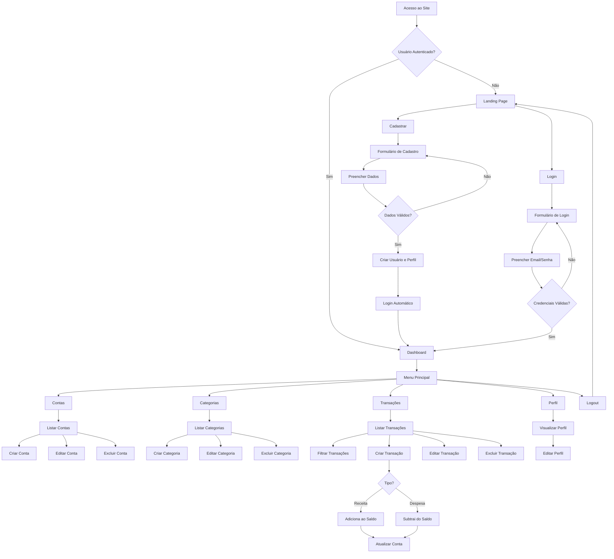
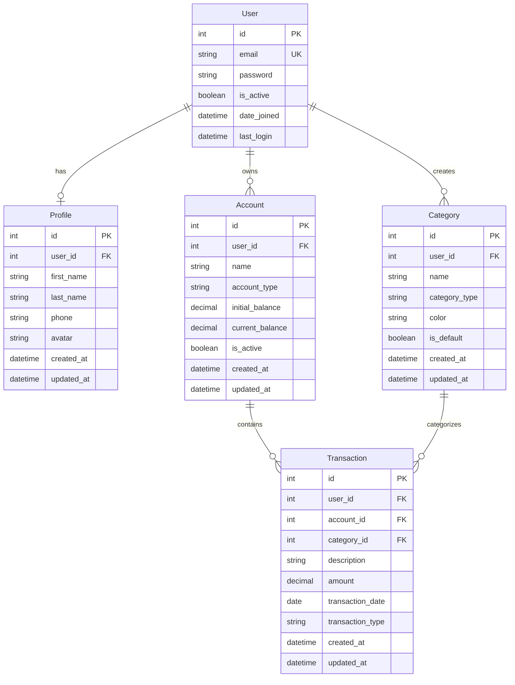

# PRD - Finanpy
## Product Requirement Document

---

## 1. Visão Geral

O **Finanpy** é um sistema de gestão de finanças pessoais desenvolvido com Django, que permite aos usuários controlar suas receitas, despesas, contas bancárias e categorizar suas transações de forma simples e intuitiva. O projeto prioriza simplicidade, praticidade e uma experiência de usuário moderna e responsiva.

---

## 2. Sobre o Produto

O Finanpy é uma aplicação web full-stack construída com Django que oferece uma solução completa para gerenciamento financeiro pessoal. Utilizando o Django Template Language com TailwindCSS, o sistema apresenta uma interface moderna com design em modo escuro e gradientes harmônicos. A arquitetura é modular, separando as responsabilidades em apps Django distintos (users, profiles, accounts, categories, transactions), garantindo manutenibilidade e escalabilidade.

---

## 3. Propósito

Fornecer uma ferramenta simples, eficiente e acessível para que pessoas possam:
- Controlar suas finanças pessoais de forma organizada
- Visualizar entradas e saídas de forma clara
- Categorizar transações para melhor análise de gastos
- Gerenciar múltiplas contas bancárias
- Tomar decisões financeiras mais conscientes através de dados consolidados

---

## 4. Público Alvo

- **Primário**: Pessoas físicas que buscam organizar suas finanças pessoais
- **Secundário**: Profissionais liberais e freelancers que precisam controlar receitas e despesas
- **Características**:
  - Idade: 18-55 anos
  - Acesso à internet e dispositivos desktop/mobile
  - Nível de alfabetização digital: básico a avançado
  - Necessidade de controle financeiro pessoal

---

## 5. Objetivos

### 5.1 Objetivos de Negócio
- Criar uma solução simples e funcional para gestão financeira pessoal
- Desenvolver um MVP enxuto sem over-engineering
- Estabelecer base sólida para futuras expansões

### 5.2 Objetivos de Produto
- Permitir cadastro e autenticação segura de usuários via email
- Possibilitar gerenciamento completo de contas bancárias
- Facilitar registro e categorização de transações financeiras
- Apresentar dashboard com visão consolidada das finanças
- Garantir interface responsiva e agradável em todos os dispositivos

### 5.3 Objetivos Técnicos
- Desenvolver aplicação Django seguindo boas práticas (PEP8)
- Implementar arquitetura modular com separação de responsabilidades
- Utilizar recursos nativos do Django (Class-Based Views, sistema de autenticação)
- Criar design system consistente com TailwindCSS

---

## 6. Requisitos Funcionais

### 6.1 Autenticação e Usuários
- **RF001**: Sistema deve permitir cadastro de novos usuários
- **RF002**: Sistema deve permitir login via email e senha
- **RF003**: Sistema deve permitir logout
- **RF004**: Sistema deve permitir recuperação de senha
- **RF005**: Usuário deve ter perfil associado automaticamente

### 6.2 Perfil de Usuário
- **RF006**: Usuário deve visualizar seu perfil
- **RF007**: Usuário deve editar informações do perfil
- **RF008**: Sistema deve armazenar created_at e updated_at do perfil

### 6.3 Contas Bancárias
- **RF009**: Usuário deve criar contas bancárias
- **RF010**: Usuário deve editar contas bancárias
- **RF011**: Usuário deve excluir contas bancárias
- **RF012**: Usuário deve listar suas contas bancárias
- **RF013**: Conta deve ter: nome, tipo, saldo inicial, saldo atual
- **RF014**: Usuário só pode ver suas próprias contas

### 6.4 Categorias
- **RF015**: Usuário deve criar categorias personalizadas
- **RF016**: Usuário deve editar categorias
- **RF017**: Usuário deve excluir categorias (se não houver transações vinculadas)
- **RF018**: Usuário deve listar suas categorias
- **RF019**: Categoria deve ter: nome, tipo (receita/despesa), cor
- **RF020**: Sistema deve fornecer categorias padrão iniciais

### 6.5 Transações
- **RF021**: Usuário deve registrar transações (receitas/despesas)
- **RF022**: Usuário deve editar transações
- **RF023**: Usuário deve excluir transações
- **RF024**: Usuário deve listar transações com filtros
- **RF025**: Transação deve ter: descrição, valor, data, tipo, categoria, conta
- **RF026**: Sistema deve atualizar saldo da conta ao criar/editar/excluir transação
- **RF027**: Usuário deve filtrar transações por período, categoria, tipo, conta

### 6.6 Dashboard
- **RF028**: Dashboard deve exibir saldo total de todas as contas
- **RF029**: Dashboard deve exibir total de receitas do período
- **RF030**: Dashboard deve exibir total de despesas do período
- **RF031**: Dashboard deve exibir saldo do período (receitas - despesas)
- **RF032**: Dashboard deve listar últimas transações
- **RF033**: Dashboard deve exibir resumo por categoria
- **RF034**: Dashboard deve permitir seleção de período de análise

### 6.7 Site Público
- **RF035**: Site deve ter página inicial pública
- **RF036**: Página inicial deve apresentar o produto
- **RF037**: Página inicial deve ter botões de cadastro e login
- **RF038**: Após login, redirecionar para dashboard

### 6.8 Flowchart - Fluxos de UX



---

## 7. Requisitos Não-Funcionais

### 7.1 Usabilidade
- **RNF001**: Interface deve ser intuitiva e de fácil navegação
- **RNF002**: Sistema deve ser responsivo (desktop, tablet, mobile)
- **RNF003**: Feedback visual para todas as ações do usuário
- **RNF004**: Mensagens de erro claras e em português

### 7.2 Performance
- **RNF005**: Páginas devem carregar em menos de 2 segundos
- **RNF006**: Sistema deve suportar até 1000 transações por usuário sem degradação
- **RNF007**: Queries ao banco devem ser otimizadas

### 7.3 Segurança
- **RNF008**: Senhas devem ser armazenadas com hash
- **RNF009**: Sessões devem expirar após período de inatividade
- **RNF010**: Validação de dados no backend
- **RNF011**: Proteção contra CSRF
- **RNF012**: Usuários só podem acessar seus próprios dados

### 7.4 Manutenibilidade
- **RNF013**: Código deve seguir PEP8
- **RNF014**: Código deve usar aspas simples
- **RNF015**: Código deve estar em inglês
- **RNF016**: Arquitetura modular com apps separados
- **RNF017**: Documentação clara em docstrings

### 7.5 Compatibilidade
- **RNF018**: Suporte aos navegadores modernos (Chrome, Firefox, Safari, Edge)
- **RNF019**: Python 3.10+
- **RNF020**: Django 4.2+

---

## 8. Arquitetura Técnica

### 8.1 Stack Tecnológica

**Backend:**
- Python 3.13+
- Django 5+
- SQLite (banco de dados)

**Frontend:**
- Django Template Language
- django-tailwind (TailwindCSS integration)
- TailwindCSS 3.x
- JavaScript vanilla (mínimo necessário)

**Infraestrutura (Sprints Finais):**
- Docker (futuro)
- Testes automatizados (futuro)
- Gerenciador de pacote pip

### 8.2 Estrutura de Dados



### 8.3 Modelo de Dados Detalhado

**User (Django default)**
- Utiliza modelo AbstractUser customizado
- Email como USERNAME_FIELD

**Profile**
- `user`: OneToOneField(User)
- `first_name`: CharField(max_length=100)
- `last_name`: CharField(max_length=100)
- `phone`: CharField(max_length=20, blank=True)
- `avatar`: ImageField(blank=True, null=True)
- `created_at`: DateTimeField(auto_now_add=True)
- `updated_at`: DateTimeField(auto_now=True)

**Account**
- `user`: ForeignKey(User)
- `name`: CharField(max_length=100)
- `account_type`: CharField(choices=['checking', 'savings', 'investment', 'other'])
- `initial_balance`: DecimalField(max_digits=12, decimal_places=2)
- `current_balance`: DecimalField(max_digits=12, decimal_places=2)
- `is_active`: BooleanField(default=True)
- `created_at`: DateTimeField(auto_now_add=True)
- `updated_at`: DateTimeField(auto_now=True)

**Category**
- `user`: ForeignKey(User)
- `name`: CharField(max_length=100)
- `category_type`: CharField(choices=['income', 'expense'])
- `color`: CharField(max_length=7)
- `is_default`: BooleanField(default=False)
- `created_at`: DateTimeField(auto_now_add=True)
- `updated_at`: DateTimeField(auto_now=True)

**Transaction**
- `user`: ForeignKey(User)
- `account`: ForeignKey(Account)
- `category`: ForeignKey(Category)
- `description`: CharField(max_length=255)
- `amount`: DecimalField(max_digits=12, decimal_places=2)
- `transaction_date`: DateField()
- `transaction_type`: CharField(choices=['income', 'expense'])
- `created_at`: DateTimeField(auto_now_add=True)
- `updated_at`: DateTimeField(auto_now=True)

---

## 9. Design System

### 9.1 Paleta de Cores (TailwindCSS)

**Cores Primárias:**
- Primary: `bg-gradient-to-r from-purple-600 to-blue-600`
- Secondary: `bg-gradient-to-r from-cyan-500 to-blue-500`
- Accent: `bg-gradient-to-r from-pink-500 to-purple-600`

**Cores de Fundo:**
- Background Principal: `bg-gray-900`
- Background Secundário: `bg-gray-800`
- Background Card: `bg-gray-800/50 backdrop-blur-sm`
- Border: `border-gray-700`

**Cores de Texto:**
- Texto Principal: `text-gray-100`
- Texto Secundário: `text-gray-400`
- Texto Destaque: `text-white`

**Cores de Status:**
- Sucesso: `text-green-400`, `bg-green-500`
- Erro: `text-red-400`, `bg-red-500`
- Aviso: `text-yellow-400`, `bg-yellow-500`
- Info: `text-blue-400`, `bg-blue-500`

**Cores Funcionais:**
- Receita: `text-green-400`, `bg-green-500/10`
- Despesa: `text-red-400`, `bg-red-500/10`

### 9.2 Tipografia

**Família de Fontes:**
```css
font-family: 'Inter', system-ui, -apple-system, sans-serif;
```

**Tamanhos:**
- Heading 1: `text-4xl font-bold` (36px)
- Heading 2: `text-3xl font-bold` (30px)
- Heading 3: `text-2xl font-semibold` (24px)
- Heading 4: `text-xl font-semibold` (20px)
- Body Large: `text-lg` (18px)
- Body: `text-base` (16px)
- Body Small: `text-sm` (14px)
- Caption: `text-xs` (12px)

### 9.3 Componentes

**Botões:**

*Primário:*
```html
<button class="px-6 py-3 bg-gradient-to-r from-purple-600 to-blue-600 text-white rounded-lg font-semibold hover:from-purple-700 hover:to-blue-700 transition-all duration-200 shadow-lg hover:shadow-xl">
    Texto do Botão
</button>
```

*Secundário:*
```html
<button class="px-6 py-3 bg-gray-700 text-gray-100 rounded-lg font-semibold hover:bg-gray-600 transition-all duration-200">
    Texto do Botão
</button>
```

*Outline:*
```html
<button class="px-6 py-3 border-2 border-purple-600 text-purple-400 rounded-lg font-semibold hover:bg-purple-600/10 transition-all duration-200">
    Texto do Botão
</button>
```

*Perigo:*
```html
<button class="px-6 py-3 bg-red-600 text-white rounded-lg font-semibold hover:bg-red-700 transition-all duration-200">
    Excluir
</button>
```

**Inputs:**
```html
<div class="mb-4">
    <label class="block text-sm font-medium text-gray-300 mb-2">
        Label do Campo
    </label>
    <input type="text" 
           class="w-full px-4 py-3 bg-gray-700 border border-gray-600 rounded-lg text-gray-100 placeholder-gray-400 focus:outline-none focus:ring-2 focus:ring-purple-600 focus:border-transparent transition-all duration-200"
           placeholder="Digite aqui...">
</div>
```

**Select:**
```html
<div class="mb-4">
    <label class="block text-sm font-medium text-gray-300 mb-2">
        Selecione uma opção
    </label>
    <select class="w-full px-4 py-3 bg-gray-700 border border-gray-600 rounded-lg text-gray-100 focus:outline-none focus:ring-2 focus:ring-purple-600 focus:border-transparent transition-all duration-200">
        <option>Opção 1</option>
        <option>Opção 2</option>
    </select>
</div>
```

**Textarea:**
```html
<div class="mb-4">
    <label class="block text-sm font-medium text-gray-300 mb-2">
        Descrição
    </label>
    <textarea rows="4" 
              class="w-full px-4 py-3 bg-gray-700 border border-gray-600 rounded-lg text-gray-100 placeholder-gray-400 focus:outline-none focus:ring-2 focus:ring-purple-600 focus:border-transparent transition-all duration-200"
              placeholder="Digite aqui..."></textarea>
</div>
```

**Cards:**
```html
<div class="bg-gray-800/50 backdrop-blur-sm border border-gray-700 rounded-xl p-6 shadow-lg hover:shadow-xl transition-all duration-200">
    <h3 class="text-xl font-semibold text-gray-100 mb-2">Título do Card</h3>
    <p class="text-gray-400">Conteúdo do card...</p>
</div>
```

**Cards com Gradiente:**
```html
<div class="bg-gradient-to-br from-purple-600/20 to-blue-600/20 backdrop-blur-sm border border-purple-500/30 rounded-xl p-6 shadow-lg">
    <h3 class="text-xl font-semibold text-gray-100 mb-2">Título do Card</h3>
    <p class="text-gray-400">Conteúdo do card...</p>
</div>
```

**Formulários:**
```html
<form class="bg-gray-800/50 backdrop-blur-sm border border-gray-700 rounded-xl p-8 shadow-lg">
    <h2 class="text-2xl font-bold text-gray-100 mb-6">Título do Formulário</h2>
    
    <!-- Inputs aqui -->
    
    <div class="flex gap-4 mt-6">
        <button type="submit" class="flex-1 px-6 py-3 bg-gradient-to-r from-purple-600 to-blue-600 text-white rounded-lg font-semibold hover:from-purple-700 hover:to-blue-700 transition-all duration-200">
            Salvar
        </button>
        <button type="button" class="px-6 py-3 bg-gray-700 text-gray-100 rounded-lg font-semibold hover:bg-gray-600 transition-all duration-200">
            Cancelar
        </button>
    </div>
</form>
```

### 9.4 Layout e Grid

**Container Principal:**
```html
<div class="min-h-screen bg-gray-900">
    <!-- Conteúdo -->
</div>
```

**Container de Conteúdo:**
```html
<div class="container mx-auto px-4 py-8 max-w-7xl">
    <!-- Conteúdo -->
</div>
```

**Grid de Cards:**
```html
<div class="grid grid-cols-1 md:grid-cols-2 lg:grid-cols-3 gap-6">
    <!-- Cards -->
</div>
```

**Grid de Dashboard:**
```html
<div class="grid grid-cols-1 md:grid-cols-2 lg:grid-cols-4 gap-6 mb-8">
    <!-- Cards de métricas -->
</div>
```

### 9.5 Navegação

**Navbar:**
```html
<nav class="bg-gray-800/80 backdrop-blur-md border-b border-gray-700 sticky top-0 z-50">
    <div class="container mx-auto px-4">
        <div class="flex items-center justify-between h-16">
            <div class="flex items-center">
                <h1 class="text-2xl font-bold bg-gradient-to-r from-purple-400 to-blue-400 bg-clip-text text-transparent">
                    Finanpy
                </h1>
            </div>
            <div class="hidden md:flex items-center gap-6">
                <a href="#" class="text-gray-300 hover:text-white transition-colors">Dashboard</a>
                <a href="#" class="text-gray-300 hover:text-white transition-colors">Contas</a>
                <a href="#" class="text-gray-300 hover:text-white transition-colors">Transações</a>
                <a href="#" class="text-gray-300 hover:text-white transition-colors">Categorias</a>
            </div>
            <div class="flex items-center gap-4">
                <button class="text-gray-300 hover:text-white">
                    <span class="text-sm">Perfil</span>
                </button>
            </div>
        </div>
    </div>
</nav>
```

**Sidebar (Mobile Menu):**
```html
<div class="fixed inset-0 bg-gray-900/90 backdrop-blur-sm z-40 md:hidden">
    <div class="fixed inset-y-0 left-0 w-64 bg-gray-800 border-r border-gray-700 p-6">
        <!-- Menu items -->
    </div>
</div>
```

### 9.6 Mensagens e Alertas

**Sucesso:**
```html
<div class="bg-green-500/10 border border-green-500/30 rounded-lg p-4 mb-4">
    <p class="text-green-400 text-sm">Operação realizada com sucesso!</p>
</div>
```

**Erro:**
```html
<div class="bg-red-500/10 border border-red-500/30 rounded-lg p-4 mb-4">
    <p class="text-red-400 text-sm">Ocorreu um erro. Tente novamente.</p>
</div>
```

**Aviso:**
```html
<div class="bg-yellow-500/10 border border-yellow-500/30 rounded-lg p-4 mb-4">
    <p class="text-yellow-400 text-sm">Atenção: Esta ação é irreversível.</p>
</div>
```

### 9.7 Tabelas

```html
<div class="overflow-x-auto bg-gray-800/50 backdrop-blur-sm border border-gray-700 rounded-xl">
    <table class="w-full">
        <thead>
            <tr class="border-b border-gray-700">
                <th class="px-6 py-4 text-left text-sm font-semibold text-gray-300">Coluna 1</th>
                <th class="px-6 py-4 text-left text-sm font-semibold text-gray-300">Coluna 2</th>
                <th class="px-6 py-4 text-left text-sm font-semibold text-gray-300">Ações</th>
            </tr>
        </thead>
        <tbody>
            <tr class="border-b border-gray-700/50 hover:bg-gray-700/30 transition-colors">
                <td class="px-6 py-4 text-sm text-gray-100">Dado 1</td>
                <td class="px-6 py-4 text-sm text-gray-100">Dado 2</td>
                <td class="px-6 py-4 text-sm">
                    <button class="text-blue-400 hover:text-blue-300">Editar</button>
                    <button class="text-red-400 hover:text-red-300 ml-4">Excluir</button>
                </td>
            </tr>
        </tbody>
    </table>
</div>
```

### 9.8 Badges e Tags

**Badge Receita:**
```html
<span class="inline-flex items-center px-3 py-1 rounded-full text-xs font-medium bg-green-500/10 text-green-400 border border-green-500/30">
    Receita
</span>
```

**Badge Despesa:**
```html
<span class="inline-flex items-center px-3 py-1 rounded-full text-xs font-medium bg-red-500/10 text-red-400 border border-red-500/30">
    Despesa
</span>
```

### 9.9 Loading States

```html
<div class="flex items-center justify-center py-12">
    <div class="animate-spin rounded-full h-12 w-12 border-t-2 border-b-2 border-purple-500"></div>
</div>
```

### 9.10 Empty States

```html
<div class="text-center py-12">
    <div class="text-gray-500 text-6xl mb-4">📊</div>
    <h3 class="text-xl font-semibold text-gray-300 mb-2">Nenhum registro encontrado</h3>
    <p class="text-gray-400 mb-6">Comece adicionando seu primeiro item</p>
    <button class="px-6 py-3 bg-gradient-to-r from-purple-600 to-blue-600 text-white rounded-lg font-semibold hover:from-purple-700 hover:to-blue-700 transition-all duration-200">
        Adicionar Agora
    </button>
</div>
```

---

## 10. User Stories

### Épico 1: Autenticação e Cadastro de Usuários

**US001 - Cadastro de Novo Usuário**
- **Como** visitante
- **Quero** me cadastrar no sistema
- **Para** começar a gerenciar minhas finanças

**Critérios de Aceite:**
- [ ] Formulário deve solicitar: email, senha, confirmação de senha
- [ ] Email deve ser único no sistema
- [ ] Senha deve ter no mínimo 8 caracteres
- [ ] Sistema deve validar formato do email
- [ ] Sistema deve validar se senhas coincidem
- [ ] Após cadastro bem-sucedido, usuário é logado automaticamente
- [ ] Perfil é criado automaticamente para o novo usuário
- [ ] Mensagem de sucesso é exibida
- [ ] Erros de validação são exibidos claramente

**US002 - Login de Usuário**
- **Como** usuário cadastrado
- **Quero** fazer login com meu email e senha
- **Para** acessar o sistema

**Critérios de Aceite:**
- [ ] Login deve aceitar email e senha
- [ ] Sistema deve validar credenciais
- [ ] Usuário é redirecionado para dashboard após login
- [ ] Mensagem de erro clara para credenciais inválidas
- [ ] Opção "Lembrar-me" disponível
- [ ] Link para recuperação de senha visível

**US003 - Logout**
- **Como** usuário autenticado
- **Quero** fazer logout do sistema
- **Para** encerrar minha sessão com segurança

**Critérios de Aceite:**
- [ ] Botão de logout visível em todas as páginas autenticadas
- [ ] Ao fazer logout, sessão é encerrada
- [ ] Usuário é redirecionado para página inicial pública
- [ ] Mensagem de confirmação de logout

**US004 - Recuperação de Senha**
- **Como** usuário que esqueceu a senha
- **Quero** recuperar meu acesso
- **Para** voltar a usar o sistema

**Critérios de Aceite:**
- [ ] Link "Esqueci minha senha" na página de login
- [ ] Formulário solicita email cadastrado
- [ ] Email com link de recuperação é enviado
- [ ] Link tem validade de 24 horas
- [ ] Formulário para redefinir senha
- [ ] Confirmação de senha necessária
- [ ] Mensagem de sucesso após redefinição

### Épico 2: Perfil de Usuário

**US005 - Visualizar Perfil**
- **Como** usuário autenticado
- **Quero** visualizar meu perfil
- **Para** verificar minhas informações

**Critérios de Aceite:**
- [ ] Página exibe: nome, sobrenome, email, telefone
- [ ] Avatar do usuário é exibido (ou placeholder)
- [ ] Datas de criação e atualização visíveis
- [ ] Botão para editar perfil

**US006 - Editar Perfil**
- **Como** usuário autenticado
- **Quero** editar meu perfil
- **Para** manter minhas informações atualizadas

**Critérios de Aceite:**
- [ ] Formulário com campos: nome, sobrenome, telefone
- [ ] Possibilidade de upload de avatar
- [ ] Validação de campos obrigatórios
- [ ] Mensagem de sucesso após salvar
- [ ] Perfil atualizado imediatamente
- [ ] Campo updated_at atualizado

### Épico 3: Gerenciamento de Contas Bancárias

**US007 - Criar Conta Bancária**
- **Como** usuário autenticado
- **Quero** cadastrar uma conta bancária
- **Para** registrar minhas transações nela

**Critérios de Aceite:**
- [ ] Formulário solicita: nome, tipo, saldo inicial
- [ ] Tipos disponíveis: Conta Corrente, Poupança, Investimento, Outro
- [ ] Saldo inicial pode ser zero ou negativo
- [ ] Saldo atual é igual ao saldo inicial na criação
- [ ] Validação de campos obrigatórios
- [ ] Mensagem de sucesso
- [ ] Redirecionamento para lista de contas

**US008 - Listar Contas Bancárias**
- **Como** usuário autenticado
- **Quero** ver todas minhas contas
- **Para** ter visão geral do meu patrimônio

**Critérios de Aceite:**
- [ ] Lista exibe: nome, tipo, saldo atual
- [ ] Contas inativas são identificadas visualmente
- [ ] Botões de ação: editar, excluir
- [ ] Saldo total de todas as contas exibido
- [ ] Botão para criar nova conta
- [ ] Empty state se não houver contas
- [ ] Ordenação por nome ou saldo

**US009 - Editar Conta Bancária**
- **Como** usuário autenticado
- **Quero** editar dados da conta
- **Para** corrigir ou atualizar informações

**Critérios de Aceite:**
- [ ] Formulário pré-preenchido com dados atuais
- [ ] Campos editáveis: nome, tipo
- [ ] Saldo inicial não editável (apenas via transação de ajuste)
- [ ] Possibilidade de ativar/desativar conta
- [ ] Validação de campos
- [ ] Mensagem de sucesso
- [ ] Atualização imediata na listagem

**US010 - Excluir Conta Bancária**
- **Como** usuário autenticado
- **Quero** excluir uma conta
- **Para** remover contas que não uso mais

**Critérios de Aceite:**
- [ ] Modal de confirmação antes de excluir
- [ ] Aviso se conta possui transações
- [ ] Não permitir exclusão se houver transações (ou oferecer migração)
- [ ] Mensagem de sucesso após exclusão
- [ ] Remoção imediata da listagem

### Épico 4: Gerenciamento de Categorias

**US011 - Criar Categoria**
- **Como** usuário autenticado
- **Quero** criar categorias personalizadas
- **Para** organizar minhas transações

**Critérios de Aceite:**
- [ ] Formulário solicita: nome, tipo, cor
- [ ] Tipos: Receita ou Despesa
- [ ] Seletor de cor visual
- [ ] Validação de nome único por usuário
- [ ] Mensagem de sucesso
- [ ] Redirecionamento para lista de categorias

**US012 - Listar Categorias**
- **Como** usuário autenticado
- **Quero** ver minhas categorias
- **Para** gerenciá-las

**Critérios de Aceite:**
- [ ] Lista separada por tipo (Receita/Despesa)
- [ ] Exibe: nome, cor, tipo
- [ ] Categorias padrão identificadas
- [ ] Botões de ação: editar, excluir
- [ ] Botão para criar nova categoria
- [ ] Empty state se não houver categorias personalizadas

**US013 - Editar Categoria**
- **Como** usuário autenticado
- **Quero** editar uma categoria
- **Para** ajustar nome ou aparência

**Critérios de Aceite:**
- [ ] Formulário pré-preenchido
- [ ] Não permitir editar categorias padrão
- [ ] Campos editáveis: nome, cor
- [ ] Tipo não editável
- [ ] Validação de nome único
- [ ] Mensagem de sucesso

**US014 - Excluir Categoria**
- **Como** usuário autenticado
- **Quero** excluir categorias não utilizadas
- **Para** manter organização

**Critérios de Aceite:**
- [ ] Modal de confirmação
- [ ] Não permitir exclusão se houver transações vinculadas
- [ ] Não permitir exclusão de categorias padrão
- [ ] Mensagem de sucesso
- [ ] Remoção imediata da listagem

**US015 - Categorias Padrão**
- **Como** novo usuário
- **Quero** ter categorias padrão criadas
- **Para** começar a usar o sistema rapidamente

**Critérios de Aceite:**
- [ ] Sistema cria categorias padrão no primeiro acesso
- [ ] Receitas: Salário, Freelance, Investimentos, Outros
- [ ] Despesas: Alimentação, Transporte, Moradia, Saúde, Lazer, Educação, Outros
- [ ] Cada categoria tem cor diferenciada
- [ ] Categorias marcadas como is_default=True

### Épico 5: Gerenciamento de Transações

**US016 - Criar Transação**
- **Como** usuário autenticado
- **Quero** registrar uma transação
- **Para** controlar minhas receitas e despesas

**Critérios de Aceite:**
- [ ] Formulário solicita: descrição, valor, data, tipo, categoria, conta
- [ ] Tipos: Receita ou Despesa
- [ ] Data padrão: hoje
- [ ] Validação de campos obrigatórios
- [ ] Valor deve ser positivo
- [ ] Apenas categorias do tipo selecionado aparecem
- [ ] Saldo da conta é atualizado automaticamente
- [ ] Mensagem de sucesso
- [ ] Redirecionamento para lista de transações

**US017 - Listar Transações**
- **Como** usuário autenticado
- **Quero** ver todas minhas transações
- **Para** acompanhar meu histórico financeiro

**Critérios de Aceite:**
- [ ] Lista exibe: data, descrição, categoria, conta, valor, tipo
- [ ] Ordenação por data (mais recente primeiro)
- [ ] Paginação (20 itens por página)
- [ ] Receitas em verde, despesas em vermelho
- [ ] Botões de ação: editar, excluir
- [ ] Botão para criar nova transação
- [ ] Empty state se não houver transações

**US018 - Filtrar Transações**
- **Como** usuário autenticado
- **Quero** filtrar transações
- **Para** analisar períodos ou categorias específicas

**Critérios de Aceite:**
- [ ] Filtros disponíveis: período (data início/fim), tipo, categoria, conta
- [ ] Aplicação de múltiplos filtros simultaneamente
- [ ] Botão limpar filtros
- [ ] URL reflete filtros aplicados
- [ ] Total de receitas e despesas filtradas exibido
- [ ] Contador de resultados

**US019 - Editar Transação**
- **Como** usuário autenticado
- **Quero** editar uma transação
- **Para** corrigir erros ou atualizar informações

**Critérios de Aceite:**
- [ ] Formulário pré-preenchido
- [ ] Todos os campos editáveis
- [ ] Saldo da conta recalculado (remove valor antigo, adiciona novo)
- [ ] Validação de campos
- [ ] Mensagem de sucesso
- [ ] Atualização imediata na listagem

**US020 - Excluir Transação**
- **Como** usuário autenticado
- **Quero** excluir uma transação
- **Para** remover registros incorretos

**Critérios de Aceite:**
- [ ] Modal de confirmação
- [ ] Saldo da conta é atualizado (estornado)
- [ ] Mensagem de sucesso
- [ ] Remoção imediata da listagem

### Épico 6: Dashboard e Visualizações

**US021 - Dashboard Principal**
- **Como** usuário autenticado
- **Quero** ver dashboard com resumo financeiro
- **Para** ter visão rápida da minha situação

**Critérios de Aceite:**
- [ ] Cards com: saldo total, receitas do mês, despesas do mês, saldo do mês
- [ ] Gráfico de receitas vs despesas
- [ ] Lista das últimas 5 transações
- [ ] Resumo por categoria (top 5 despesas)
- [ ] Seletor de período (mês atual, mês anterior, últimos 3 meses, ano)
- [ ] Todas as métricas atualizadas conforme período selecionado
- [ ] Valores em formato monetário brasileiro

**US022 - Página Inicial Pública**
- **Como** visitante
- **Quero** conhecer o Finanpy
- **Para** decidir se quero me cadastrar

**Critérios de Aceite:**
- [ ] Apresentação do produto e benefícios
- [ ] Botões de "Cadastre-se" e "Entrar" bem visíveis
- [ ] Design moderno e atraente
- [ ] Responsivo para mobile
- [ ] Rodapé com informações básicas

---

## 11. Métricas de Sucesso

### 11.1 KPIs de Produto

**Adoção:**
- Número de novos cadastros por semana/mês
- Taxa de conversão de visitantes em usuários (cadastros/visitas)
- Tempo médio para primeiro cadastro após visita

**Engajamento:**
- Número médio de transações registradas por usuário
- Frequência de uso (dias ativos por semana)
- Taxa de retorno (usuários que voltam após 7 dias)
- Tempo médio de sessão

**Retenção:**
- Taxa de retenção semanal/mensal
- Churn rate (taxa de abandono)
- DAU (Daily Active Users) / MAU (Monthly Active Users)

**Funcionalidade:**
- Número médio de contas por usuário
- Número médio de categorias customizadas por usuário
- Distribuição de uso de funcionalidades (qual % usa cada feature)

### 11.2 KPIs de Usuário

**Eficiência:**
- Tempo médio para criar uma transação
- Tempo médio para criar uma conta
- Número de cliques até completar ação principal

**Satisfação:**
- Net Promoter Score (NPS) - futuro
- Feedback qualitativo via formulário - futuro
- Taxa de conclusão de tarefas

**Valor Gerado:**
- Valor total de transações gerenciadas
- Número de usuários com > 30 transações (indicador de uso real)
- Porcentagem de usuários que usam filtros no dashboard

### 11.3 KPIs Técnicos

**Performance:**
- Tempo de carregamento das páginas (< 3s)
- Taxa de erros 500
- Uptime do sistema (> 99%)

**Qualidade:**
- Número de bugs reportados por sprint
- Cobertura de testes (meta: > 80%) - futuro
- Dívida técnica acumulada

---

## 12. Riscos e Mitigações

### 12.1 Riscos Técnicos

**R001 - Perda de Dados**
- **Probabilidade:** Baixa
- **Impacto:** Alto
- **Mitigação:** 
  - Implementar backup automático do SQLite
  - Adicionar confirmações antes de exclusões
  - Implementar soft delete em futuras versões

**R002 - Performance com Muitas Transações**
- **Probabilidade:** Média
- **Impacto:** Médio
- **Mitigação:**
  - Implementar paginação em todas as listagens
  - Adicionar índices no banco de dados
  - Otimizar queries com select_related/prefetch_related

**R003 - Segurança de Dados**
- **Probabilidade:** Baixa
- **Impacto:** Alto
- **Mitigação:**
  - Usar sistema de autenticação nativo do Django
  - Validar permissões em todas as views
  - Implementar HTTPS em produção
  - Sanitizar inputs

**R004 - Incompatibilidade de Navegadores**
- **Probabilidade:** Baixa
- **Impacto:** Médio
- **Mitigação:**
  - Testar em principais navegadores
  - Usar TailwindCSS (compatível)
  - Evitar JavaScript muito moderno

### 12.2 Riscos de Produto

**R005 - Baixa Adoção de Usuários**
- **Probabilidade:** Média
- **Impacto:** Alto
- **Mitigação:**
  - Focar em UX simples e intuitiva
  - Criar categorias padrão para facilitar início
  - Tutorial de primeiro uso
  - Landing page atraente

**R006 - Complexidade para Usuário Final**
- **Probabilidade:** Baixa
- **Impacto:** Médio
- **Mitigação:**
  - Design minimalista
  - Mensagens claras e em português
  - Tooltips explicativos quando necessário
  - Manter sistema enxuto

**R007 - Abandono por Falta de Features**
- **Probabilidade:** Média
- **Impacto:** Médio
- **Mitigação:**
  - Roadmap claro de evolução
  - Coletar feedback dos usuários
  - Priorizar features mais solicitadas

### 12.3 Riscos de Desenvolvimento

**R008 - Atraso no Cronograma**
- **Probabilidade:** Média
- **Impacto:** Médio
- **Mitigação:**
  - Sprints bem definidas com escopo fechado
  - Buffer time em cada sprint
  - Priorização clara de features

**R009 - Débito Técnico Acumulado**
- **Probabilidade:** Média
- **Impacto:** Médio
- **Mitigação:**
  - Code review
  - Seguir padrões desde o início
  - Refatoração contínua
  - Documentação

---

## 13. Lista de Tarefas

### Sprint 0 - Configuração Inicial (Semana 1)

#### Tarefa 1: Setup do Projeto Django
- [X] 1.1 - Criar ambiente virtual Python
  - Instalar Python 3.10+
  - Criar venv: `python -m venv venv`
  - Ativar venv
- [X] 1.2 - Instalar Django e dependências
  - Django 4.2+
  - django-tailwind e django-tailwind[reload]
  - Pillow (para avatares)
  - python-decouple (variáveis de ambiente)
- [X] 1.3 - Criar projeto Django
  - `django-admin startproject core .`
  - Verificar estrutura criada
  - Testar servidor: `python manage.py runserver`
- [] 1.4 - Configurar settings.py inicial
  - Definir SECRET_KEY
  - Configurar ALLOWED_HOSTS
  - Definir TIME_ZONE = 'America/Sao_Paulo'
  - Configurar LANGUAGE_CODE = 'pt-br'
  - Configurar STATIC_URL e STATIC_ROOT
  - Configurar MEDIA_URL e MEDIA_ROOT

#### Tarefa 2: Criar Apps Django
- [X] 2.1 - Criar app users
  - `python manage.py startapp users`
  - Adicionar em INSTALLED_APPS
- [X] 2.2 - Criar app profiles
  - `python manage.py startapp profiles`
  - Adicionar em INSTALLED_APPS
- [X] 2.3 - Criar app accounts
  - `python manage.py startapp accounts`
  - Adicionar em INSTALLED_APPS
- [X] 2.4 - Criar app categories
  - `python manage.py startapp categories`
  - Adicionar em INSTALLED_APPS
- [X] 2.5 - Criar app transactions
  - `python manage.py startapp transactions`
  - Adicionar em INSTALLED_APPS

#### Tarefa 3: Configurar TailwindCSS com django-tailwind
- [ ] 3.1 - Instalar django-tailwind
  - `pip install django-tailwind`
  - `pip install 'django-tailwind[reload]'` (para hot reload)
- [ ] 3.2 - Adicionar ao INSTALLED_APPS
  - 'tailwind' em settings.py
  - Antes dos apps do projeto
- [ ] 3.3 - Criar app theme
  - `python manage.py tailwind init`
  - Nome sugerido: 'theme'
  - Adicionar 'theme' ao INSTALLED_APPS
- [ ] 3.4 - Configurar TAILWIND_APP_NAME
  - settings.py: TAILWIND_APP_NAME = 'theme'
- [ ] 3.5 - Configurar INTERNAL_IPS (para reload)
  - settings.py: INTERNAL_IPS = ['127.0.0.1']
- [ ] 3.6 - Instalar dependências do Tailwind
  - `python manage.py tailwind install`
  - Instala Node.js automaticamente via django-tailwind
- [ ] 3.7 - Customizar theme/static_src/tailwind.config.js
  - Configurar tema customizado (cores escuras)
  - Adicionar gradientes personalizados
  - Configurar content paths (já vem pré-configurado)
- [ ] 3.8 - Testar build
  - `python manage.py tailwind build`
  - Verificar CSS gerado
- [ ] 3.9 - Criar estrutura de diretórios static adicional
  - static/js/
  - static/images/

#### Tarefa 4: Configurar Templates Base
- [ ] 4.1 - Criar diretório templates
  - templates/
  - templates/base/
  - templates/partials/
- [ ] 4.2 - Criar base.html
  - Estrutura HTML5
  -  no topo
  -  no head para incluir CSS
  - Definir blocks: title, content, extra_css, extra_js
  - Adicionar meta tags responsivas
- [ ] 4.3 - Configurar TEMPLATES em settings.py
  - Definir DIRS com caminho de templates
  - Configurar context_processors
- [ ] 4.4 - Criar template para mensagens
  - templates/partials/messages.html
  - Usar Django messages framework
  - Estilizar com TailwindCSS (success, error, warning, info)

#### Tarefa 5: Git e Controle de Versão
- [ ] 5.1 - Inicializar repositório Git
  - `git init`
- [ ] 5.2 - Criar .gitignore
  - Adicionar venv/
  - Adicionar __pycache__/
  - Adicionar *.pyc
  - Adicionar db.sqlite3
  - Adicionar .env
  - Adicionar theme/static_src/node_modules/ (gerado por django-tailwind)
  - Adicionar theme/static/ (CSS compilado)
- [ ] 5.3 - Criar README.md
  - Descrição do projeto
  - Instruções de setup
  - Comandos principais
  - Comando para rodar Tailwind: `python manage.py tailwind start`
- [ ] 5.4 - Primeiro commit
  - `git add .`
  - `git commit -m "Initial project setup"`

**Nota sobre desenvolvimento:**
Durante o desenvolvimento, usar `python manage.py tailwind start` em um terminal separado para hot reload automático do CSS ao editar templates.

---

### Sprint 1 - Autenticação e Usuários (Semana 2)

#### Tarefa 6: Modelo de Usuário Customizado
- [ ] 6.1 - Criar CustomUser model em users/models.py
  - Herdar de AbstractUser
  - Definir USERNAME_FIELD = 'email'
  - Definir REQUIRED_FIELDS = []
  - Adicionar campo email único
  - Remover campo username
- [ ] 6.2 - Criar CustomUserManager
  - Implementar create_user()
  - Implementar create_superuser()
  - Validar email obrigatório
- [ ] 6.3 - Configurar AUTH_USER_MODEL em settings.py
  - AUTH_USER_MODEL = 'users.CustomUser'
- [ ] 6.4 - Criar e aplicar migrations
  - `python manage.py makemigrations`
  - `python manage.py migrate`
- [ ] 6.5 - Registrar model no admin
  - users/admin.py
  - Usar UserAdmin customizado
  - Configurar list_display, search_fields

#### Tarefa 7: Modelo de Profile
- [ ] 7.1 - Criar Profile model em profiles/models.py
  - Campo user (OneToOneField com User)
  - Campo first_name (CharField)
  - Campo last_name (CharField)
  - Campo phone (CharField, opcional)
  - Campo avatar (ImageField, opcional)
  - Campo created_at (DateTimeField)
  - Campo updated_at (DateTimeField)
  - Método __str__
- [ ] 7.2 - Criar signal para criação automática de Profile
  - profiles/signals.py
  - Signal post_save do User
  - Criar Profile ao criar User
- [ ] 7.3 - Configurar signal em apps.py
  - profiles/apps.py
  - Importar signals no ready()
- [ ] 7.4 - Criar e aplicar migrations
  - `python manage.py makemigrations profiles`
  - `python manage.py migrate profiles`
- [ ] 7.5 - Registrar Profile no admin
  - profiles/admin.py
  - Configurar list_display

#### Tarefa 8: Views de Autenticação
- [ ] 8.1 - Criar view de cadastro (SignUpView)
  - users/views.py
  - Class-based view (CreateView)
  - Form com email, password1, password2
  - Validações de senha
  - Login automático após cadastro
  - Redirect para dashboard
- [ ] 8.2 - Criar UserCreationForm customizado
  - users/forms.py
  - Basear em UserCreationForm do Django
  - Campos: email, password1, password2
  - Validações customizadas
  - Help texts em português
- [ ] 8.3 - Criar view de login (LoginView)
  - users/views.py
  - Usar LoginView do Django
  - Customizar template
  - Configurar success_url
- [ ] 8.4 - Criar view de logout (LogoutView)
  - users/views.py
  - Usar LogoutView do Django
  - Redirect para home
- [ ] 8.5 - Configurar URLs de autenticação
  - users/urls.py criar arquivo
  - Adicionar rotas: signup/, login/, logout/
  - Incluir em core/urls.py

#### Tarefa 9: Templates de Autenticação
- [ ] 9.1 - Criar estrutura de templates users
  - templates/users/
- [ ] 9.2 - Criar template de cadastro
  - templates/users/signup.html
  - Herdar de base.html
  - Formulário estilizado com TailwindCSS
  - Link para login
  - Validações visuais
- [ ] 9.3 - Criar template de login
  - templates/users/login.html
  - Formulário com email e senha
  - Checkbox "Lembrar-me"
  - Link para cadastro
  - Link para recuperação de senha
- [ ] 9.4 - Estilizar forms com TailwindCSS
  - Inputs com bg-gray-700
  - Borders e focus states
  - Labels em text-gray-300
  - Botões com gradiente
  - Mensagens de erro em red

#### Tarefa 10: Recuperação de Senha
- [ ] 10.1 - Configurar backend de email
  - settings.py
  - EMAIL_BACKEND para console (dev)
  - Preparar para SMTP (prod futuro)
- [ ] 10.2 - Criar views de recuperação
  - Usar PasswordResetView
  - PasswordResetDoneView
  - PasswordResetConfirmView
  - PasswordResetCompleteView
- [ ] 10.3 - Criar templates de recuperação
  - password_reset_form.html
  - password_reset_done.html
  - password_reset_confirm.html
  - password_reset_complete.html
- [ ] 10.4 - Configurar URLs de recuperação
  - password-reset/
  - password-reset/done/
  - password-reset-confirm/<uidb64>/<token>/
  - password-reset-complete/
- [ ] 10.5 - Estilizar templates com TailwindCSS
  - Manter consistência visual
  - Cards e formulários
  - Mensagens informativas

---

### Sprint 2 - Perfil de Usuário (Semana 3)

#### Tarefa 11: Views de Perfil
- [ ] 11.1 - Criar ProfileDetailView
  - profiles/views.py
  - Class-based view (DetailView)
  - Obter perfil do usuário logado
  - LoginRequiredMixin
- [ ] 11.2 - Criar ProfileUpdateView
  - profiles/views.py
  - Class-based view (UpdateView)
  - Form com first_name, last_name, phone, avatar
  - Validações
  - Success message
- [ ] 11.3 - Criar ProfileForm
  - profiles/forms.py
  - ModelForm do Profile
  - Campos editáveis
  - Widgets customizados
  - Labels em português
- [ ] 11.4 - Configurar URLs de perfil
  - profiles/urls.py criar arquivo
  - profile/ (detail)
  - profile/edit/ (update)
  - Incluir em core/urls.py

#### Tarefa 12: Templates de Perfil
- [ ] 12.1 - Criar estrutura templates profiles
  - templates/profiles/
- [ ] 12.2 - Criar template de visualização
  - templates/profiles/profile_detail.html
  - Exibir avatar (ou placeholder)
  - Exibir todas informações
  - Botão "Editar Perfil"
  - Cards estilizados
- [ ] 12.3 - Criar template de edição
  - templates/profiles/profile_form.html
  - Formulário completo
  - Preview de avatar
  - Botões Salvar e Cancelar
- [ ] 12.4 - Adicionar link no menu
  - Navbar com link "Perfil"
  - Acessível de todas as páginas

#### Tarefa 13: Upload de Avatar
- [ ] 13.1 - Configurar MEDIA settings
  - settings.py
  - MEDIA_URL = '/media/'
  - MEDIA_ROOT = BASE_DIR / 'media'
- [ ] 13.2 - Configurar URLs para servir media (dev)
  - core/urls.py
  - Adicionar static() para MEDIA_URL
- [ ] 13.3 - Criar diretório media/avatars
  - Estrutura de pastas
- [ ] 13.4 - Implementar validação de imagem
  - Tamanho máximo (2MB)
  - Formatos permitidos (jpg, png)
  - Mensagens de erro
- [ ] 13.5 - Criar placeholder para avatar padrão
  - Imagem ou ícone SVG
  - Exibir quando sem avatar

---

### Sprint 3 - Contas Bancárias (Semana 4)

#### Tarefa 14: Modelo de Account
- [ ] 14.1 - Criar Account model
  - accounts/models.py
  - Campo user (ForeignKey)
  - Campo name (CharField)
  - Campo account_type (CharField com choices)
  - Campo initial_balance (DecimalField)
  - Campo current_balance (DecimalField)
  - Campo is_active (BooleanField)
  - Campos created_at e updated_at
  - Método __str__
- [ ] 14.2 - Definir choices para account_type
  - CHECKING = 'checking'
  - SAVINGS = 'savings'
  - INVESTMENT = 'investment'
  - OTHER = 'other'
  - Labels em português
- [ ] 14.3 - Adicionar Meta class
  - ordering = ['name']
  - verbose_name em português
- [ ] 14.4 - Criar e aplicar migrations
  - makemigrations accounts
  - migrate accounts
- [ ] 14.5 - Registrar no admin
  - accounts/admin.py
  - list_display, list_filter, search_fields

#### Tarefa 15: Forms de Account
- [ ] 15.1 - Criar AccountForm
  - accounts/forms.py
  - ModelForm do Account
  - Campos: name, account_type, initial_balance
  - Widgets customizados
  - Labels e help_texts em português
- [ ] 15.2 - Customizar widget de account_type
  - Select estilizado
  - Opções traduzidas
- [ ] 15.3 - Validações customizadas
  - Nome obrigatório
  - Initial balance pode ser negativo
  - Mensagens de erro em português

#### Tarefa 16: Views de Account
- [ ] 16.1 - Criar AccountListView
  - accounts/views.py
  - ListView
  - Filtrar por user = request.user
  - LoginRequiredMixin
  - Ordenar por nome
- [ ] 16.2 - Criar AccountCreateView
  - CreateView
  - Associar user automaticamente
  - Set current_balance = initial_balance
  - Success message
  - Redirect para list
- [ ] 16.3 - Criar AccountUpdateView
  - UpdateView
  - Verificar propriedade (user)
  - Não permitir editar initial_balance
  - Success message
- [ ] 16.4 - Criar AccountDeleteView
  - DeleteView
  - Verificar propriedade
  - Confirmação
  - Success message
  - Redirect para list
- [ ] 16.5 - Criar AccountDetailView (opcional)
  - DetailView
  - Exibir detalhes completos
  - Listar transações da conta

#### Tarefa 17: Templates de Account
- [ ] 17.1 - Criar estrutura templates accounts
  - templates/accounts/
- [ ] 17.2 - Criar account_list.html
  - Lista em cards ou tabela
  - Saldo total destacado
  - Botão "Nova Conta"
  - Ações: editar, excluir
  - Empty state
- [ ] 17.3 - Criar account_form.html
  - Formulário de criação/edição
  - Reutilizável para create e update
  - Estilizado com TailwindCSS
- [ ] 17.4 - Criar account_confirm_delete.html
  - Modal ou página de confirmação
  - Avisos se houver transações
  - Botões confirmar/cancelar
- [ ] 17.5 - Adicionar no menu
  - Link "Contas" na navbar
  - Destacar quando ativo

#### Tarefa 18: URLs de Account
- [ ] 18.1 - Criar accounts/urls.py
  - Padrão RESTful
  - accounts/ (list)
  - accounts/create/ (create)
  - accounts/<pk>/ (detail)
  - accounts/<pk>/edit/ (update)
  - accounts/<pk>/delete/ (delete)
- [ ] 18.2 - Incluir em core/urls.py
  - path('accounts/', include('accounts.urls'))

---

### Sprint 4 - Categorias (Semana 5)

#### Tarefa 19: Modelo de Category
- [ ] 19.1 - Criar Category model
  - categories/models.py
  - Campo user (ForeignKey)
  - Campo name (CharField)
  - Campo category_type (CharField com choices)
  - Campo color (CharField para hex color)
  - Campo is_default (BooleanField)
  - Campos created_at e updated_at
  - Método __str__
- [ ] 19.2 - Definir choices para category_type
  - INCOME = 'income'
  - EXPENSE = 'expense'
  - Labels em português
- [ ] 19.3 - Criar constraint de unicidade
  - unique_together = ['user', 'name']
- [ ] 19.4 - Criar e aplicar migrations
  - makemigrations categories
  - migrate categories
- [ ] 19.5 - Registrar no admin
  - categories/admin.py
  - list_display com cor visual
  - list_filter por tipo

#### Tarefa 20: Categorias Padrão
- [ ] 20.1 - Criar management command
  - categories/management/commands/
  - create_default_categories.py
- [ ] 20.2 - Implementar lógica do comando
  - Listar categorias padrão
  - Definir cores para cada uma
  - Criar se não existir
  - Marcar is_default=True
- [ ] 20.3 - Definir categorias de receita
  - Salário (#10b981)
  - Freelance (#3b82f6)
  - Investimentos (#8b5cf6)
  - Outros (#6b7280)
- [ ] 20.4 - Definir categorias de despesa
  - Alimentação (#ef4444)
  - Transporte (#f59e0b)
  - Moradia (#06b6d4)
  - Saúde (#ec4899)
  - Lazer (#14b8a6)
  - Educação (#6366f1)
  - Outros (#6b7280)
- [ ] 20.5 - Integrar comando ao signal de criação de usuário
  - Executar ao criar novo usuário
  - profiles/signals.py

#### Tarefa 21: Forms de Category
- [ ] 21.1 - Criar CategoryForm
  - categories/forms.py
  - ModelForm do Category
  - Campos: name, category_type, color
  - Excluir is_default
- [ ] 21.2 - Implementar color picker
  - Input type="color"
  - Estilização customizada
  - Valor padrão
- [ ] 21.3 - Validação de nome único
  - Por usuário
  - Mensagem de erro clara
- [ ] 21.4 - Prevenir edição de categorias padrão
  - Verificação no form
  - Ou desabilitar campos

#### Tarefa 22: Views de Category
- [ ] 22.1 - Criar CategoryListView
  - categories/views.py
  - Separar receitas e despesas
  - Filtrar por user
  - LoginRequiredMixin
- [ ] 22.2 - Criar CategoryCreateView
  - Associar user automaticamente
  - is_default = False
  - Success message
- [ ] 22.3 - Criar CategoryUpdateView
  - Verificar propriedade
  - Não permitir editar is_default=True
  - Success message
- [ ] 22.4 - Criar CategoryDeleteView
  - Verificar se tem transações
  - Não permitir deletar is_default=True
  - Confirmação
  - Success message
- [ ] 22.5 - Adicionar validação de transações vinculadas
  - Query para verificar
  - Mensagem de erro se houver

#### Tarefa 23: Templates de Category
- [ ] 23.1 - Criar templates/categories/
- [ ] 23.2 - Criar category_list.html
  - Duas colunas: Receitas | Despesas
  - Cards com cor da categoria
  - Badge "Padrão" para is_default
  - Ações: editar, excluir (se permitido)
  - Botão "Nova Categoria"
- [ ] 23.3 - Criar category_form.html
  - Formulário com color picker
  - Radio buttons para tipo
  - Preview da cor selecionada
- [ ] 23.4 - Criar category_confirm_delete.html
  - Avisos apropriados
  - Verificação de transações
- [ ] 23.5 - Adicionar no menu
  - Link "Categorias"

#### Tarefa 24: URLs de Category
- [ ] 24.1 - Criar categories/urls.py
  - categories/ (list)
  - categories/create/
  - categories/<pk>/edit/
  - categories/<pk>/delete/
- [ ] 24.2 - Incluir em core/urls.py

---

### Sprint 5 - Transações (Semana 6-7)

#### Tarefa 25: Modelo de Transaction
- [ ] 25.1 - Criar Transaction model
  - transactions/models.py
  - Campo user (ForeignKey)
  - Campo account (ForeignKey)
  - Campo category (ForeignKey)
  - Campo description (CharField)
  - Campo amount (DecimalField, positivo)
  - Campo transaction_date (DateField)
  - Campo transaction_type (CharField com choices)
  - Campos created_at e updated_at
  - Método __str__
- [ ] 25.2 - Definir choices para transaction_type
  - INCOME = 'income'
  - EXPENSE = 'expense'
- [ ] 25.3 - Adicionar Meta class
  - ordering = ['-transaction_date', '-created_at']
  - indexes para queries comuns
- [ ] 25.4 - Criar e aplicar migrations
  - makemigrations transactions
  - migrate transactions
- [ ] 25.5 - Registrar no admin
  - list_display, list_filter, date_hierarchy

#### Tarefa 26: Signals para Atualização de Saldo
- [ ] 26.1 - Criar transactions/signals.py
- [ ] 26.2 - Signal post_save para Transaction
  - Calcular impacto no saldo
  - Se income: account.current_balance += amount
  - Se expense: account.current_balance -= amount
  - Salvar account
- [ ] 26.3 - Signal pre_save para edição
  - Calcular diferença
  - Estornar valor antigo
  - Aplicar valor novo
- [ ] 26.4 - Signal post_delete para Transaction
  - Estornar valor da transação
  - Atualizar saldo da conta
- [ ] 26.5 - Configurar signal em apps.py
  - transactions/apps.py
  - Importar signals

#### Tarefa 27: Forms de Transaction
- [ ] 27.1 - Criar TransactionForm
  - transactions/forms.py
  - ModelForm do Transaction
  - Campos: description, amount, transaction_date, transaction_type, category, account
- [ ] 27.2 - Filtrar categorias por tipo
  - JavaScript ou lógica no form
  - Ao selecionar tipo, filtrar categorias
- [ ] 27.3 - Filtrar contas do usuário
  - Apenas contas ativas
  - Do usuário logado
- [ ] 27.4 - Widgets customizados
  - Date picker
  - Input de valor formatado
  - Select estilizado
- [ ] 27.5 - Validações
  - Valor positivo
  - Data não futura (opcional)
  - Campos obrigatórios

#### Tarefa 28: Views de Transaction
- [ ] 28.1 - Criar TransactionListView
  - transactions/views.py
  - ListView com paginação (20 items)
  - Filtrar por user
  - LoginRequiredMixin
  - Ordenar por data desc
- [ ] 28.2 - Criar TransactionCreateView
  - CreateView
  - Associar user automaticamente
  - Data padrão = hoje
  - Success message
  - Redirect para list
- [ ] 28.3 - Criar TransactionUpdateView
  - UpdateView
  - Verificar propriedade
  - Success message
- [ ] 28.4 - Criar TransactionDeleteView
  - DeleteView
  - Confirmação
  - Success message
- [ ] 28.5 - Criar TransactionDetailView (opcional)
  - DetailView
  - Exibir todos os detalhes

#### Tarefa 29: Filtros de Transaction
- [ ] 29.1 - Criar TransactionFilterForm
  - forms.py
  - Campos: date_from, date_to, transaction_type, category, account
  - Todos opcionais
- [ ] 29.2 - Implementar filtros na ListView
  - Obter parâmetros GET
  - Aplicar filtros na queryset
  - Passar form para template
- [ ] 29.3 - Calcular totais filtrados
  - Total de receitas
  - Total de despesas
  - Saldo (receitas - despesas)
  - Passar para context
- [ ] 29.4 - Preservar filtros na URL
  - Query params
  - Pagination com filtros
- [ ] 29.5 - Botão "Limpar Filtros"
  - Remover todos os params
  - Voltar à lista completa

#### Tarefa 30: Templates de Transaction
- [ ] 30.1 - Criar templates/transactions/
- [ ] 30.2 - Criar transaction_list.html
  - Formulário de filtros no topo
  - Cards de totais (receitas, despesas, saldo)
  - Tabela de transações
  - Receitas em verde, despesas em vermelho
  - Paginação
  - Empty state
  - Botão "Nova Transação"
- [ ] 30.3 - Criar transaction_form.html
  - Formulário completo
  - JavaScript para filtro de categorias
  - Date picker
  - Validações visuais
- [ ] 30.4 - Criar transaction_confirm_delete.html
  - Confirmação com detalhes
  - Avisar sobre impacto no saldo
- [ ] 30.5 - Adicionar no menu
  - Link "Transações"

#### Tarefa 31: URLs de Transaction
- [ ] 31.1 - Criar transactions/urls.py
  - transactions/ (list com filtros)
  - transactions/create/
  - transactions/<pk>/
  - transactions/<pk>/edit/
  - transactions/<pk>/delete/
- [ ] 31.2 - Incluir em core/urls.py

#### Tarefa 32: JavaScript para Filtros Dinâmicos
- [ ] 32.1 - Criar static/js/transactions.js
- [ ] 32.2 - Implementar filtro de categoria por tipo
  - Listener no campo transaction_type
  - Filtrar options do select de categoria
  - Show/hide baseado no tipo
- [ ] 32.3 - Implementar date picker
  - Usar input type="date"
  - Ou biblioteca leve se necessário
- [ ] 32.4 - Validação de valor numérico
  - Aceitar apenas números e vírgula/ponto
  - Formatar em tempo real
- [ ] 32.5 - Incluir script nos templates

---

### Sprint 6 - Dashboard (Semana 8)

#### Tarefa 33: View do Dashboard
- [ ] 33.1 - Criar DashboardView
  - Criar app 'dashboard' ou usar em core
  - TemplateView
  - LoginRequiredMixin
- [ ] 33.2 - Implementar cálculo de saldo total
  - Somar current_balance de todas as contas ativas
  - Do usuário logado
- [ ] 33.3 - Implementar cálculo de receitas do período
  - Filtrar transações type=income
  - Por período selecionado
  - Somar amounts
- [ ] 33.4 - Implementar cálculo de despesas do período
  - Filtrar transações type=expense
  - Por período selecionado
  - Somar amounts
- [ ] 33.5 - Calcular saldo do período
  - receitas - despesas
- [ ] 33.6 - Buscar últimas 5 transações
  - Ordenar por data desc
  - Limitar a 5
- [ ] 33.7 - Calcular resumo por categoria
  - Top 5 categorias com mais despesas
  - Agrupar e somar
- [ ] 33.8 - Implementar seletor de período
  - Mês atual (padrão)
  - Mês anterior
  - Últimos 3 meses
  - Ano atual
  - Período customizado

#### Tarefa 34: Template do Dashboard
- [ ] 34.1 - Criar templates/dashboard/
- [ ] 34.2 - Criar dashboard.html
  - Estrutura com grid responsivo
  - 4 cards de métricas principais
  - Seletor de período
- [ ] 34.3 - Cards de métricas
  - Saldo Total (gradiente verde/azul)
  - Receitas do Período (verde)
  - Despesas do Período (vermelho)
  - Saldo do Período (azul/roxo)
  - Valores formatados em R$
- [ ] 34.4 - Seção de últimas transações
  - Lista estilizada
  - Link "Ver todas"
- [ ] 34.5 - Seção de resumo por categoria
  - Cards ou barras
  - Cores das categorias
  - Percentuais
- [ ] 34.6 - Adicionar gráfico simples (opcional)
  - Chart.js via CDN
  - Gráfico de pizza ou barras
  - Receitas vs Despesas
- [ ] 34.7 - Responsividade
  - Mobile: cards em coluna
  - Tablet: 2 colunas
  - Desktop: 4 colunas

#### Tarefa 35: URLs e Navegação
- [ ] 35.1 - Criar URL do dashboard
  - dashboard/ ou home/
  - Incluir em core/urls.py
- [ ] 35.2 - Configurar LOGIN_REDIRECT_URL
  - settings.py
  - Apontar para dashboard
- [ ] 35.3 - Configurar LOGOUT_REDIRECT_URL
  - Apontar para landing page
- [ ] 35.4 - Adicionar "Dashboard" no menu
  - Primeiro item da navbar
  - Ícone de home

---

### Sprint 7 - Landing Page Pública (Semana 9)

#### Tarefa 36: View da Landing Page
- [ ] 36.1 - Criar LandingPageView
  - core/views.py ou app 'website'
  - TemplateView
  - Acessível sem login
- [ ] 36.2 - Verificar se usuário está autenticado
  - Se sim, redirect para dashboard
  - Se não, mostrar landing page

#### Tarefa 37: Template da Landing Page
- [ ] 37.1 - Criar templates/landing/
- [ ] 37.2 - Criar landing.html
  - Hero section com gradiente
  - Título e subtítulo atrativos
  - CTAs: "Cadastre-se Grátis" e "Entrar"
- [ ] 37.3 - Seção de benefícios
  - 3-4 cards com features principais
  - Ícones ou emojis
  - Textos persuasivos
- [ ] 37.4 - Seção de como funciona
  - Passos numerados
  - Descrições curtas
- [ ] 37.5 - Footer
  - Nome do projeto
  - Ano
  - Links úteis (futuro)
- [ ] 37.6 - Design moderno
  - Gradientes
  - Animações suaves (hover, scroll)
  - Totalmente responsivo
- [ ] 37.7 - Otimizar textos
  - Português claro
  - Foco em benefícios
  - Call to action forte

#### Tarefa 38: URLs da Landing Page
- [ ] 38.1 - Configurar URL raiz
  - path('', LandingPageView.as_view())
  - core/urls.py
- [ ] 38.2 - Testar redirecionamento
  - Usuário logado → dashboard
  - Usuário não logado → landing

---

### Sprint 8 - Navbar e Layout Global (Semana 10)

#### Tarefa 39: Navbar Responsiva
- [ ] 39.1 - Criar templates/partials/navbar.html
- [ ] 39.2 - Implementar logo/brand
  - Texto "Finanpy" com gradiente
  - Link para home (dashboard se logado)
- [ ] 39.3 - Menu desktop
  - Links: Dashboard, Contas, Transações, Categorias
  - Destacar página ativa
  - Dropdown de perfil
- [ ] 39.4 - Menu mobile
  - Botão hamburger
  - Sidebar ou dropdown
  - Mesmos links do desktop
- [ ] 39.5 - Dropdown de usuário
  - Nome do usuário
  - Avatar (se tiver)
  - Link "Meu Perfil"
  - Link "Sair"
- [ ] 39.6 - JavaScript para menu mobile
  - Toggle sidebar
  - Close ao clicar fora
  - static/js/navbar.js
- [ ] 39.7 - Sticky navbar
  - Fixed no topo
  - Backdrop blur
  - Sombra ao scroll

#### Tarefa 40: Base Template Refinamento
- [ ] 40.1 - Atualizar base.html
  - Incluir navbar
  - Incluir messages
  - Estrutura de container
- [ ] 40.2 - Criar partial de footer
  - templates/partials/footer.html
  - Informações básicas
  - Simples e discreto
- [ ] 40.3 - Configurar blocks
  - 
  - 
  - 
  - 
- [ ] 40.4 - Adicionar meta tags
  - Viewport
  - Description
  - Charset UTF-8
- [ ] 40.5 - Favicon
  - Criar ou usar emoji
  - Adicionar no base.html

#### Tarefa 41: Consistência Visual
- [ ] 41.1 - Revisar todos os templates
  - Verificar uso consistente de cores
  - Verificar espaçamentos
  - Verificar tipografia
- [ ] 41.2 - Padronizar botões
  - Primário, secundário, danger
  - Tamanhos consistentes
  - Estados hover/active
- [ ] 41.3 - Padronizar cards
  - Mesmo estilo em todo sistema
  - Padding e borders iguais
  - Efeitos hover
- [ ] 41.4 - Padronizar formulários
  - Mesmos inputs em todos os forms
  - Mensagens de erro no mesmo lugar
  - Botões alinhados
- [ ] 41.5 - Criar componentes reutilizáveis
  - templates/components/button.html
  - templates/components/card.html
  - templates/components/form_field.html

---

### Sprint 9 - Polimento e UX (Semana 11)

#### Tarefa 42: Melhorias de UX
- [ ] 42.1 - Implementar confirmações de exclusão
  - Modals com SweetAlert2 ou nativo
  - Textos claros de confirmação
- [ ] 42.2 - Melhorar feedback de ações
  - Mensagens de sucesso mais visíveis
  - Duração adequada (3-5s)
  - Posição consistente
- [ ] 42.3 - Loading states
  - Spinner ao submeter forms
  - Skeleton screens em listas
  - Desabilitar botões durante submit
- [ ] 42.4 - Validações em tempo real
  - JavaScript para validar antes de submit
  - Feedback visual imediato
  - Mensagens claras
- [ ] 42.5 - Tooltips e hints
  - Explicações em campos complexos
  - Ícones de ajuda
  - Instruções contextuais

#### Tarefa 43: Acessibilidade
- [ ] 43.1 - Adicionar labels adequados
  - Todos os inputs com label
  - For/id corretos
- [ ] 43.2 - ARIA labels onde necessário
  - Botões sem texto
  - Ícones
  - Navegação
- [ ] 43.3 - Contraste de cores
  - Verificar WCAG AA
  - Ajustar se necessário
- [ ] 43.4 - Navegação por teclado
  - Tab order lógico
  - Focus visível
  - Atalhos (futuro)
- [ ] 43.5 - Textos alternativos
  - Alt em imagens
  - Title em links/botões

#### Tarefa 44: Performance
- [ ] 44.1 - Otimizar queries
  - select_related para ForeignKeys
  - prefetch_related para M2M
  - Apenas campos necessários
- [ ] 44.2 - Adicionar índices
  - Campos mais consultados
  - created_at, transaction_date
- [ ] 44.3 - Paginação eficiente
  - Limit/offset
  - Não carregar tudo
- [ ] 44.4 - Otimizar CSS com django-tailwind
  - TailwindCSS já vem configurado com purge
  - Verificar content paths em tailwind.config.js
  - Build para produção: `python manage.py tailwind build`
  - Apenas classes usadas serão incluídas
- [ ] 44.5 - Lazy loading de imagens
  - Avatares
  - Imagens grandes (futuro)

#### Tarefa 45: Responsividade
- [ ] 45.1 - Testar em mobile (375px)
  - Todos os templates
  - Ajustar breakpoints
- [ ] 45.2 - Testar em tablet (768px)
  - Layout intermediário
  - Navegação adequada
- [ ] 45.3 - Testar em desktop (1024px+)
  - Uso de espaço
  - Grid layouts
- [ ] 45.4 - Testar em diferentes navegadores
  - Chrome, Firefox, Safari, Edge
  - Versões recentes
- [ ] 45.5 - Ajustar problemas encontrados
  - CSS fixes
  - JavaScript compatibilidade

---

### Sprint 10 - Refinamentos Finais (Semana 12)

#### Tarefa 46: Formatação de Valores
- [ ] 46.1 - Criar template filter para moeda
  - templatetags/currency_filters.py
  - Formato: R$ 1.234,56
- [ ] 46.2 - Aplicar em todos os valores
  - Dashboard
  - Listas de transações
  - Contas
- [ ] 46.3 - Formatar datas
  - Formato brasileiro: dd/mm/yyyy
  - Templates filters
- [ ] 46.4 - Formatar números grandes
  - Separador de milhares
  - Casas decimais consistentes

#### Tarefa 47: Validações Adicionais
- [ ] 47.1 - Validar deleção de conta com transações
  - Prevenir ou oferecer migração
  - Mensagem clara
- [ ] 47.2 - Validar deleção de categoria em uso
  - Contar transações
  - Bloquear ou sugerir alternativa
- [ ] 47.3 - Validar valores negativos
  - Apenas em campos apropriados
  - Mensagens contextuais
- [ ] 47.4 - Validar datas futuras
  - Permitir ou não (decisão de negócio)
  - Feedback claro

#### Tarefa 48: Documentação
- [ ] 48.1 - Atualizar README.md
  - Descrição completa
  - Features implementadas
  - Screenshots (opcional)
- [ ] 48.2 - Instruções de instalação
  - Passo a passo
  - Requisitos
  - Comandos necessários
- [ ] 48.3 - Documentar estrutura do projeto
  - Apps e responsabilidades
  - Modelos principais
- [ ] 48.4 - Criar CHANGELOG.md
  - Versão 1.0.0
  - Features implementadas
- [ ] 48.5 - Docstrings em código
  - Views principais
  - Models
  - Forms customizados

#### Tarefa 49: Deploy Preparation
- [ ] 49.1 - Configurar variáveis de ambiente
  - python-decouple
  - .env.example
  - SECRET_KEY, DEBUG, ALLOWED_HOSTS
- [ ] 49.2 - Build de produção do Tailwind
  - `python manage.py tailwind build`
  - CSS otimizado e minificado
- [ ] 49.3 - Configurar arquivos estáticos para produção
  - STATIC_ROOT
  - `python manage.py collectstatic`
- [ ] 49.4 - Configurar HTTPS
  - SECURE_SSL_REDIRECT
  - SESSION_COOKIE_SECURE
  - CSRF_COOKIE_SECURE
- [ ] 49.5 - Configurar ALLOWED_HOSTS
  - Domínios permitidos
- [ ] 49.6 - Criar requirements.txt
  - Freeze dependencies
  - Versões específicas

#### Tarefa 50: Testes Finais
- [ ] 50.1 - Teste completo de cadastro
  - Novo usuário
  - Perfil criado
  - Categorias padrão
  - Redirect correto
- [ ] 50.2 - Teste de fluxo de transação
  - Criar conta
  - Criar transação
  - Verificar saldo
  - Editar transação
  - Verificar saldo atualizado
- [ ] 50.3 - Teste de filtros
  - Aplicar múltiplos filtros
  - Verificar resultados
  - Limpar filtros
- [ ] 50.4 - Teste de dashboard
  - Verificar cálculos
  - Trocar período
  - Verificar atualização
- [ ] 50.5 - Teste de validações
  - Tentar criar dados inválidos
  - Verificar mensagens de erro
  - Verificar prevenção

---

### Sprint 11 - Testes Automatizados (Futuro)

#### Tarefa 51: Setup de Testes
- [ ] 51.1 - Configurar pytest-django
  - Instalar pytest
  - pytest-django
  - pytest-cov
- [ ] 51.2 - Criar pytest.ini
  - Configurações
  - DJANGO_SETTINGS_MODULE
- [ ] 51.3 - Criar conftest.py
  - Fixtures compartilhadas
  - User fixture
  - Account fixture
- [ ] 51.4 - Estrutura de testes
  - tests/ em cada app
  - test_models.py
  - test_views.py
  - test_forms.py

#### Tarefa 52: Testes de Models
- [ ] 52.1 - Testes de User
  - Criação de usuário
  - Email único
  - Senha hash
- [ ] 52.2 - Testes de Profile
  - Signal de criação
  - Update de campos
- [ ] 52.3 - Testes de Account
  - Criação
  - Validações
  - Métodos
- [ ] 52.4 - Testes de Category
  - Criação
  - Unicidade por usuário
- [ ] 52.5 - Testes de Transaction
  - Criação
  - Signal de saldo
  - Validações

#### Tarefa 53: Testes de Views
- [ ] 53.1 - Testes de autenticação
  - Signup
  - Login
  - Logout
- [ ] 53.2 - Testes de Account views
  - List, Create, Update, Delete
  - Permissões
- [ ] 53.3 - Testes de Transaction views
  - CRUD completo
  - Filtros
- [ ] 53.4 - Testes de Dashboard
  - Cálculos corretos
  - Permissões

#### Tarefa 54: Testes de Forms
- [ ] 54.1 - Validações de forms
  - Dados válidos
  - Dados inválidos
  - Mensagens de erro
- [ ] 54.2 - Tests de limpeza
  - Clean methods
  - Validações customizadas

#### Tarefa 55: Coverage
- [ ] 55.1 - Configurar coverage
  - .coveragerc
  - Exclusões
- [ ] 55.2 - Rodar coverage
  - pytest --cov
  - Gerar relatório
- [ ] 55.3 - Meta de coverage
  - > 80% inicial
  - > 90% ideal

---

### Sprint 12 - Docker e Deploy (Futuro)

#### Tarefa 56: Dockerfile
- [ ] 56.1 - Criar Dockerfile
  - Base Python 3.10
  - Instalar dependências
  - Copy código
  - CMD para runserver
- [ ] 56.2 - Criar .dockerignore
  - venv/
  - __pycache__/
  - *.pyc
  - db.sqlite3
- [ ] 56.3 - Testar build
  - docker build
  - docker run
  - Verificar funcionamento

#### Tarefa 57: Docker Compose
- [ ] 57.1 - Criar docker-compose.yml
  - Service web
  - Volumes
  - Ports
- [ ] 57.2 - Configurar variáveis
  - Environment
  - .env file
- [ ] 57.3 - Testar compose
  - docker-compose up
  - Migrations
  - Collectstatic

#### Tarefa 58: Deploy em Servidor
- [ ] 58.1 - Escolher plataforma
  - Railway, Render, Heroku
  - VPS (futuro)
- [ ] 58.2 - Configurar servidor
  - Variáveis de ambiente
  - Banco de dados
  - Arquivos estáticos
- [ ] 58.3 - Deploy inicial
  - Push código
  - Migrations
  - Superuser
- [ ] 58.4 - Configurar domínio
  - DNS
  - SSL/HTTPS
- [ ] 58.5 - Monitoramento
  - Logs
  - Erros
  - Performance

---

## 14. Considerações Finais

### 14.1 Próximos Passos Pós-MVP

**Features Futuras:**
- Gráficos avançados e relatórios
- Exportação de dados (PDF, Excel)
- Metas financeiras
- Notificações e lembretes
- Modo escuro/claro toggle
- Múltiplas moedas
- API REST
- App mobile

**Melhorias Técnicas:**
- Migration para PostgreSQL
- Celery para tarefas assíncronas
- Redis para cache
- Elasticsearch para buscas
- CI/CD pipeline

### 14.2 Manutenção

- Code review regular
- Atualização de dependências
- Backup periódico
- Monitoramento de logs
- Análise de métricas de uso

---

**Versão do Documento:** 1.0  
**Data:** Janeiro 2026  
**Autor:** Equipe Finanpy  
**Status:** Em Desenvolvimento